# 🔐 Authorization Management System (AMS)

> **Enterprise-oriented Identity, Authentication & Authorization Platform**
>
> A modular Java-based Authorization Management System built with **Java Servlet, JSP, JDBC, and MySQL**, providing authentication, JWT, session security, TOTP-based 2FA, RBAC, fine-grained permissions, access-request workflows, approval management, audit logging, and reporting.

---

> **GitHub Mermaid Compatibility:** All architecture diagrams in this README use GitHub-compatible Mermaid syntax (` ```mermaid `). Diagram labels avoid HTML line breaks and problematic presentation characters, and subgraphs use explicit structure to keep GitHub's Mermaid/SVG renderer stable.

## 📌 Overview

**Authorization Management System (AMS)** is designed as a reusable security and authorization platform for applications that need centralized identity and access management.

It brings together:

- 🔑 Authentication
- 🎟️ JWT-based authentication
- 🛡️ Authorization
- 👥 Role-Based Access Control (RBAC)
- 🔐 Two-Factor Authentication (2FA)
- 📱 TOTP verification
- 🔑 Backup-code recovery
- 👤 User management
- 🧩 Fine-grained permission management
- 📩 Access-request workflows
- ✅ Approval workflows
- 📋 Security auditing
- 📊 Reporting
- 🔒 Session management
- 🚦 Rate limiting
- 🌐 CORS protection
- 🛡️ Security headers
- 🔏 Cryptographic utilities

The platform can be integrated with healthcare systems, ERP applications, SaaS platforms, enterprise applications, and internal management systems.

---

# 🚀 Project Vision

The goal of AMS is to provide a centralized platform for managing:

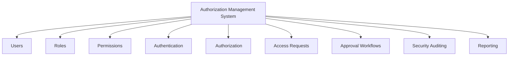

---

# ✨ Core Features

## 🔑 Authentication & Security

- Secure user authentication
- BCrypt password hashing
- Session-based authentication
- JWT authentication
- Authentication filter
- Authorization filter
- Password management
- Role-Based Access Control
- TOTP-based 2FA
- Backup-code recovery
- CORS protection
- Rate limiting
- Security headers
- SHA-256 hashing
- HMAC-SHA256 integrity protection
- Secure session management

---

# 🔐 Authentication Architecture

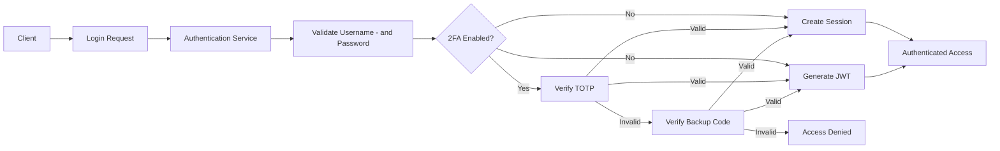

---

# 🎟️ JWT Authentication

AMS supports **JSON Web Token (JWT)** authentication for protected application requests.

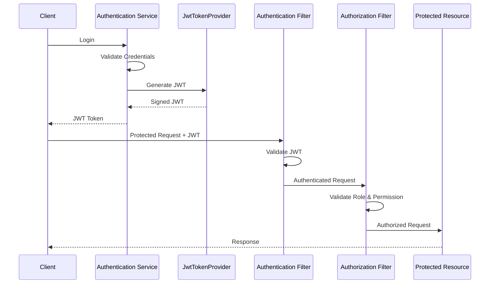

JWT functionality is provided through:

```text
security
└── crypto
    └── JwtTokenProvider
```

---

# 🔐 Two-Factor Authentication

AMS implements **TOTP-based Two-Factor Authentication**.

Compatible authenticator applications include:

- Google Authenticator
- Authy
- Other TOTP-compatible applications

## 2FA Endpoints

| Method | Endpoint | Purpose |
|---|---|---|
| POST | `/api/v1/auth/2fa/setup` | Generate TOTP secret and QR code |
| POST | `/api/v1/auth/2fa/enable` | Verify OTP and enable 2FA |
| POST | `/api/v1/auth/2fa/verify` | Verify OTP during authentication |

## 2FA Architecture

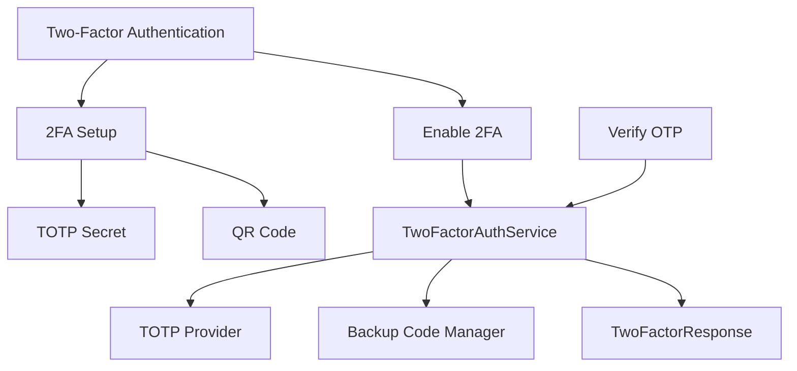

## 2FA Components

```text
security
└── twofactor
    ├── BackupCodeManager
    ├── TOTPProvider
    ├── TwoFactorAuthService
    └── TwoFactorResponse
```

The `USERS` table supports 2FA through:

```text
IS_2FA_ENABLED
TWO_FACTOR_SECRET
```

---

# 🔒 Cryptography & Data Integrity

AMS includes cryptographic utilities for authentication, integrity protection, and secure token operations.

| Mechanism | Purpose |
|---|---|
| BCrypt | Password hashing |
| SHA-256 | Cryptographic hashing / fingerprinting |
| HMAC-SHA256 | Integrity and authenticity protection |
| JWT signing | Token authentication |

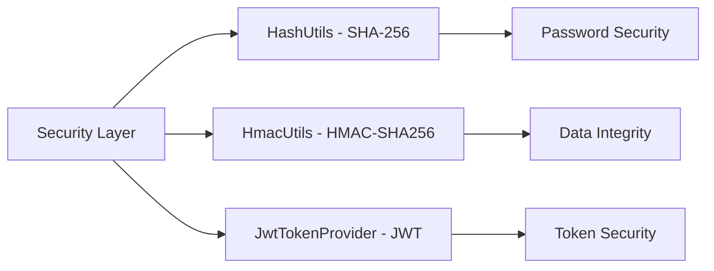

---

# 🛡️ Security Filters

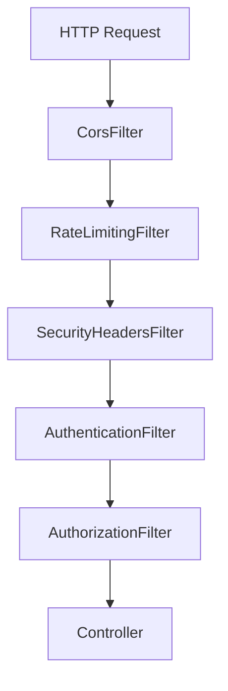

### Authentication Filter

Validates authenticated sessions or tokens before protected requests are processed.

### Authorization Filter

Validates roles and permissions before allowing access to protected resources.

### CORS Filter

Controls cross-origin HTTP requests.

### Rate Limiting Filter

Helps protect endpoints from excessive requests and abuse.

### Security Headers Filter

Adds security-related HTTP response headers.

---

# 👥 Role-Based Access Control (RBAC)

AMS follows a layered RBAC model.

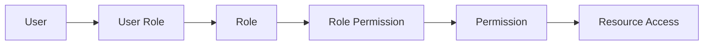

## RBAC Example

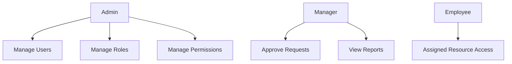

## RBAC Manager

The security layer contains a dedicated:

```text
security
└── rbac
    └── RBACManager
```

---

# 🔑 Permission Management

AMS supports fine-grained permissions.

### Capabilities

- Create permissions
- Update permissions
- Delete permissions
- Assign permissions to roles
- Validate permissions
- Control resource-level access

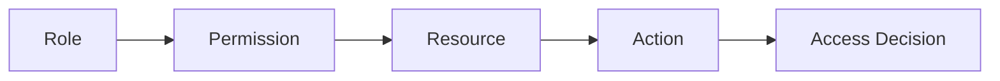

A permission can conceptually represent:

```text
Resource + Action
```

For example:

```text
USER + READ
USER + UPDATE
ROLE + CREATE
REPORT + VIEW
```

---

# 📩 Access Request Management

AMS provides controlled access-request workflows.

### Features

- Submit access requests
- Track request status
- Request additional permissions
- Temporary access management
- Approval-based access provisioning

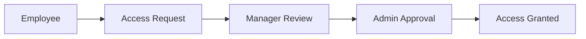

---

# ✅ Approval Workflow

AMS supports approval-based access management.

### Features

- Approve requests
- Reject requests
- Approval history
- Multi-level approval support
- Controlled access provisioning

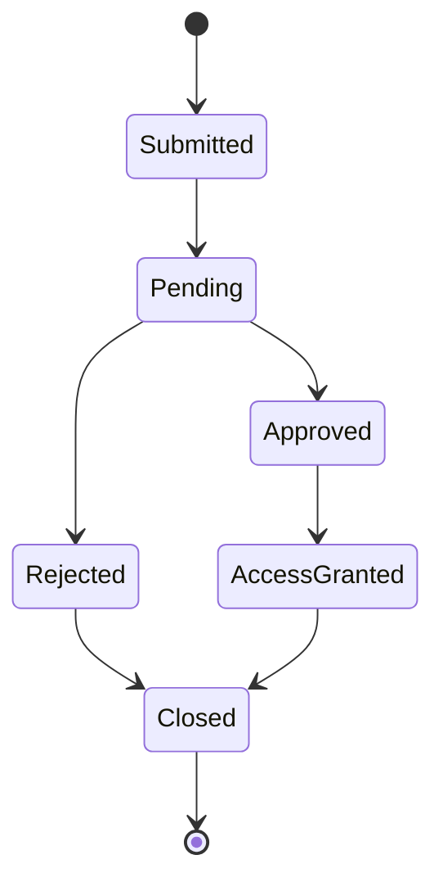

---

# 📋 Audit Management

AMS tracks security-sensitive activities for accountability.

### Audited Activities

- Login activities
- Permission changes
- Role changes
- Access requests
- Approval actions
- 2FA setup
- 2FA enablement
- 2FA verification
- Other security-related operations

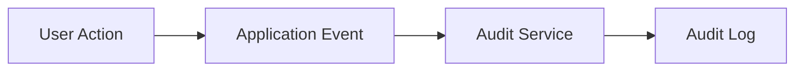

## Audit Payload

`CreateAuditLogRequest`

```text
userId
action
description
ipAddress
```

Example actions:

```text
SETUP_2FA
ENABLE_2FA
VERIFY_2FA
UPDATE_PERMISSION
UPDATE_ROLE
LOGIN
```

---

# 📊 Reporting System

AMS provides reporting capabilities for access and security management.

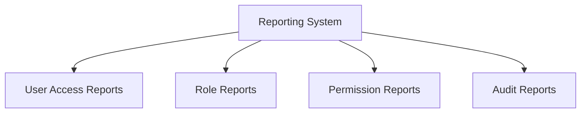

---

# 🔐 Session Management

Session management is isolated inside the security layer.

```text
security
└── session
    └── SessionManager
```

Conceptually:

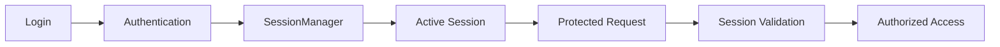

---

# 🏗️ High-Level Architecture

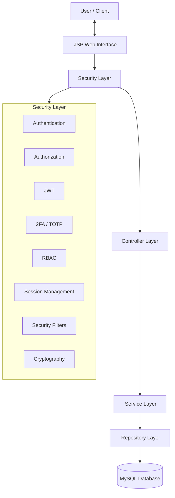

---

# 🔄 Request Processing Flow

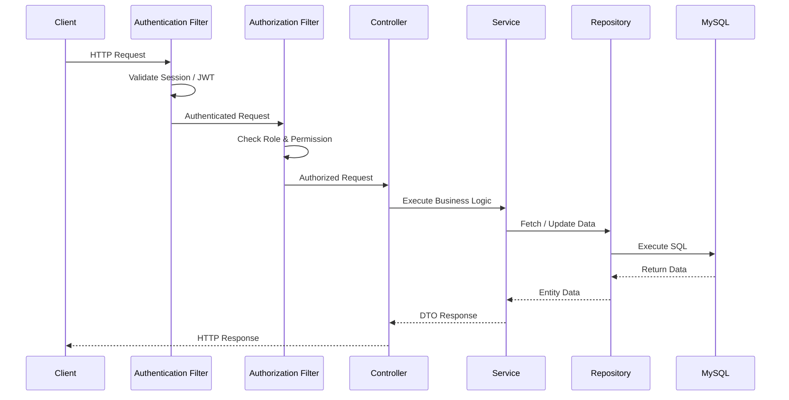

---

# 👤 User Management

AMS provides centralized user management.

### Capabilities

- Create users
- Update users
- Delete users
- Activate / deactivate users
- Assign roles
- Manage user access
- Enable / disable 2FA
- Manage authentication credentials

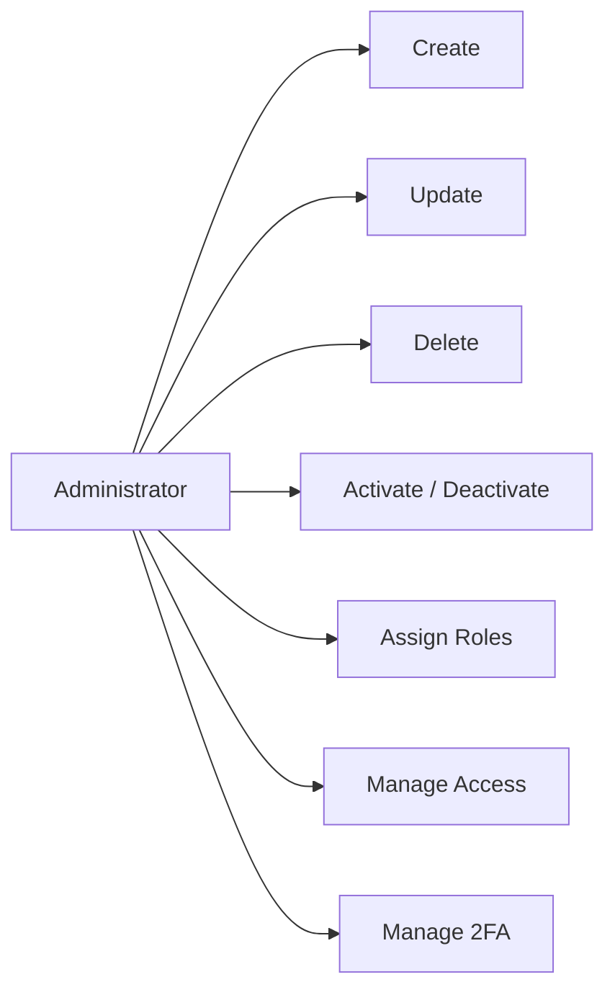

---

# 🧩 Module Architecture

AMS is organized around independent business modules.

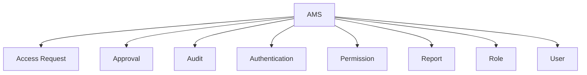

---

# 📦 Module Internal Structure

Each business module follows a consistent structure:

```text
Module
├── Controller
├── DTO
├── Entity
├── Mapper
├── Repository
├── Service
└── Validator
```

This structure supports:

- Separation of Concerns
- Maintainability
- Testability
- Module-level organization
- Code reusability

---

# 🛡️ Security Architecture

```mermaid
flowchart TB

SECURITY[" Security"]

AUTHN["Authentication"]
AUTHZ["Authorization"]
CRYPTO["Cryptography"]
FILTER["Security Filters"]
PASSWORD["Password Management"]
RBAC["RBAC"]
SESSION["Session Management"]
TWOFA["Two-Factor Authentication"]

SECURITY --> AUTHN
SECURITY --> AUTHZ
SECURITY --> CRYPTO
SECURITY --> FILTER
SECURITY --> PASSWORD
SECURITY --> RBAC
SECURITY --> SESSION
SECURITY --> TWOFA

CRYPTO --> HASH["HashUtils"]
CRYPTO --> HMAC["HmacUtils"]
CRYPTO --> JWT["JwtTokenProvider"]

FILTER --> AF["AuthenticationFilter"]
FILTER --> AZ["AuthorizationFilter"]
FILTER --> CORS["CorsFilter"]
FILTER --> RATE["RateLimitingFilter"]
FILTER --> HEADERS["SecurityHeadersFilter"]

RBAC --> RBACM["RBACManager"]

SESSION --> SM["SessionManager"]

TWOFA --> BCM["BackupCodeManager"]
TWOFA --> TOTP["TOTPProvider"]
TWOFA --> TFAS["TwoFactorAuthService"]
TWOFA --> TFR["TwoFactorResponse"]
```

---

# 🗂️ Project Structure

```text
com.ams
│
├── common
│   ├── constant
│   ├── enums
│   ├── exception
│   ├── util
│   └── validator
│       ├── CommonValidator
│       ├── EmailValidator
│       ├── PasswordValidator
│       └── PhoneValidator
│
├── config
│
├── migration
│
├── modules
│   ├── accessrequest
│   ├── approval
│   ├── audit
│   ├── auth
│   ├── permission
│   ├── report
│   ├── role
│   └── user
│
└── security
    ├── authentication
    ├── authorization
    ├── crypto
    │   ├── HashUtils
    │   ├── HmacUtils
    │   └── JwtTokenProvider
    ├── filter
    │   ├── AuthenticationFilter
    │   ├── AuthorizationFilter
    │   ├── CorsFilter
    │   ├── RateLimitingFilter
    │   └── SecurityHeadersFilter
    ├── password
    ├── rbac
    │   └── RBACManager
    ├── session
    │   └── SessionManager
    └── twofactor
        ├── BackupCodeManager
        ├── TOTPProvider
        ├── TwoFactorAuthService
        └── TwoFactorResponse
```

---

# 🗄️ Database Architecture

The primary database is **MySQL**.

## Main Tables

```text
users
roles
permissions
user_roles
role_permissions
access_request
approval
audit_log
password_reset_token
```

## Entity Relationship Diagram

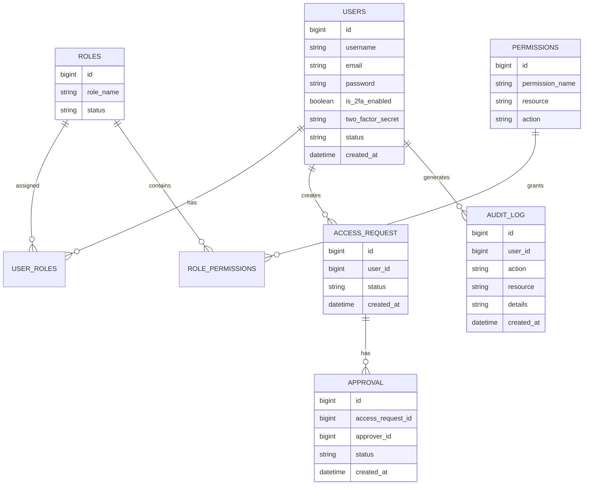

---

# 🗃️ Database Migration

AMS uses version-based database migrations.

```text
db.migration

├── V1__...
├── V2__...
├── V3__...
├── V4__...
├── V5__...
├── V6__...
├── V7__...
├── V8__...
├── V9__...
└── V10__...
```

The versioned migration structure provides controlled database-schema evolution.

---

# 🏥 Real-World Applications

## Healthcare Authorization

```mermaid
flowchart LR

HOSPITAL[" Hospital System"]

DOCTOR["‍️ Doctor"]
NURSE["‍️ Nurse"]
RECEPTION["‍ Receptionist"]
ADMIN[" Admin"]

PATIENT["Patient Records"]
PRESCRIPTION["Prescription"]
APPOINTMENT["Appointments"]
ACCESS["System Access"]

HOSPITAL --> DOCTOR
HOSPITAL --> NURSE
HOSPITAL --> RECEPTION
HOSPITAL --> ADMIN

DOCTOR --> PATIENT
DOCTOR --> PRESCRIPTION

NURSE --> PATIENT

RECEPTION --> APPOINTMENT

ADMIN --> ACCESS
```

AMS can act as an authorization layer where different healthcare staff members require different access levels.

---

# 🏢 Enterprise Employee Access Management

Organizations can manage:

- Employee accounts
- Department access
- Internal applications
- Security policies
- Application permissions

```mermaid
flowchart LR

ORG[" Organization"]

EMP["Employees"]
DEPT["Departments"]
APPS["Internal Applications"]
POLICIES["Security Policies"]
PERMISSIONS["Permissions"]

ORG --> EMP
ORG --> DEPT
ORG --> APPS
ORG --> POLICIES

POLICIES --> PERMISSIONS
PERMISSIONS --> APPS
```

---

# 💻 Application Authorization Service

AMS can operate as an authorization layer for existing applications.

```mermaid
flowchart LR

CLIENT["Client Application"]
APP["Application Layer"]
AMS[" AMS Authorization Layer"]
RESOURCE["Protected Resource"]

CLIENT --> APP
APP --> AMS
AMS --> RESOURCE
```

---

# ☁️ SaaS Authorization Platform

AMS can be extended into a multi-tenant authorization platform.

```mermaid
flowchart TB

AMS["️ AMS Platform"]

COMPANY_A["Company A"]
COMPANY_B["Company B"]

A_USERS["Users"]
A_ROLES["Roles"]
A_PERMISSIONS["Permissions"]

B_USERS["Users"]
B_ROLES["Roles"]
B_PERMISSIONS["Permissions"]

AMS --> COMPANY_A
AMS --> COMPANY_B

COMPANY_A --> A_USERS
COMPANY_A --> A_ROLES
COMPANY_A --> A_PERMISSIONS

COMPANY_B --> B_USERS
COMPANY_B --> B_ROLES
COMPANY_B --> B_PERMISSIONS
```

---

# 🛠️ Technologies

## Backend

- Java
- Servlet API
- JSP
- JDBC

## Database

- MySQL

## Frontend

- HTML
- CSS
- JavaScript
- Bootstrap

## Security

- BCrypt
- Session Authentication
- JWT
- RBAC
- TOTP / 2FA
- Backup Codes
- SHA-256
- HMAC-SHA256
- CORS Protection
- Rate Limiting
- Security Headers

## Tools

- Eclipse IDE
- Apache Tomcat
- Git
- Maven

---

# ⚙️ Installation & Setup

## 1. Clone Repository

```bash
git clone https://github.com/MotionPrograming/AuthorizationManagementSystem.git
cd AuthorizationManagementSystem
```

## 2. Create MySQL Database

```sql
CREATE DATABASE authorization_management;
```

## 3. Configure Database

Configure:

```text
resources/db.properties
```

Example:

```properties
db.url=jdbc:mysql://localhost:3306/authorization_management
db.username=root
db.password=password
```

> ⚠️ For production deployments, database credentials should be supplied through secure environment-specific configuration rather than committed to source control.

## 4. Run Database Migration

Execute:

```text
MigrationRunner.java
```

The versioned migration scripts will create and update the required database schema.

## 5. Configure Application

Verify:

- MySQL connection
- Application configuration
- JWT configuration
- Security configuration
- Session configuration
- 2FA configuration

## 6. Deploy

Deploy the application to:

```text
Apache Tomcat Server
```

Default application URL:

```text
http://localhost:8080/AuthorizationManagementSystem
```

---

# 🧠 Design Principles

The project follows:

- SOLID Principles
- Clean Code Practices
- Separation of Concerns
- Single Responsibility Principle
- Repository Pattern
- DTO Pattern
- Mapper Pattern
- Layered Architecture
- Feature-Based Architecture
- RBAC Pattern

```mermaid
flowchart LR

PRINCIPLES["Design Principles"]

SOLID["SOLID"]
CLEAN["Clean Code"]
SOC["Separation of Concerns"]
REPOSITORY["Repository Pattern"]
DTO["DTO Pattern"]
MAPPER["Mapper Pattern"]
LAYERED["Layered Architecture"]
FEATURE["Feature-Based Architecture"]
RBAC["RBAC"]

PRINCIPLES --> SOLID
PRINCIPLES --> CLEAN
PRINCIPLES --> SOC
PRINCIPLES --> REPOSITORY
PRINCIPLES --> DTO
PRINCIPLES --> MAPPER
PRINCIPLES --> LAYERED
PRINCIPLES --> FEATURE
PRINCIPLES --> RBAC
```

---

# 🚀 Scalability Roadmap

Future improvements include:

- REST API support
- OAuth 2.0 integration
- OpenID Connect (OIDC)
- Spring Boot migration
- Microservices architecture
- Redis session management
- Email notification service
- Multi-tenant SaaS architecture
- Cloud deployment
- API Gateway authorization
- Centralized Identity Provider
- Distributed audit processing
- Policy-Based Access Control (PBAC)

---

# 🔭 Future Architecture

```mermaid
flowchart LR

CLIENT["Client Applications"]
GATEWAY["API Gateway"]

IAM["Identity / Authorization Service"]
USER["User Service"]
PERMISSION["Permission Service"]
AUDIT["Audit Service"]

DB[("Database")]

CLIENT --> GATEWAY

GATEWAY --> IAM
GATEWAY --> USER
GATEWAY --> PERMISSION
GATEWAY --> AUDIT

IAM --> DB
USER --> DB
PERMISSION --> DB
AUDIT --> DB
```

---

# 🎯 System Design Goals

```mermaid
mindmap
root((AMS))
Secure Identity Management
Strong Authentication
Multi-Factor Authentication
Fine-Grained Authorization
Role-Based Access Control
Security Auditing
Controlled Access Workflows
Modular Development
Maintainability
Enterprise Scalability
Reusable Authorization
Future Microservice Migration
```

---

# 📈 Security & Authorization Flow

```mermaid
flowchart TD

REQUEST["Incoming Request"]

AUTHENTICATION[" Authentication"]
ROLE[" Role Validation"]
PERMISSION[" Permission Validation"]

DECISION{"Access Allowed?"}

ALLOW[" Allow Access"]
DENY[" Deny Access"]

REQUEST --> AUTHENTICATION
AUTHENTICATION --> ROLE
ROLE --> PERMISSION
PERMISSION --> DECISION

DECISION -->|Yes| ALLOW
DECISION -->|No| DENY
```

---

# 🔐 Security Responsibility Map

| Component | Responsibility |
|---|---|
| `AuthenticationFilter` | Authenticate protected requests |
| `AuthorizationFilter` | Validate authorization |
| `RBACManager` | Manage RBAC decisions |
| `SessionManager` | Manage application sessions |
| `JwtTokenProvider` | JWT creation/validation |
| `TOTPProvider` | TOTP operations |
| `BackupCodeManager` | Backup-code management |
| `TwoFactorAuthService` | 2FA orchestration |
| `HashUtils` | Cryptographic hashing |
| `HmacUtils` | HMAC integrity protection |

---

# 📌 Architecture Summary

```mermaid
flowchart TB

CLIENT[" Client"]

AUTHENTICATION[" Authentication"]
TWOFA[" 2FA"]
SESSION[" Session"]
JWT["️ JWT"]

AUTHORIZATION["️ Authorization"]
RBAC[" RBAC"]
PERMISSION[" Permissions"]

GOVERNANCE[" Access Governance"]
REQUEST[" Access Request"]
APPROVAL[" Approval"]

AUDITING[" Auditing & Reporting"]
AUDIT["Audit"]
REPORT["Reports"]

DATABASE[(" MySQL")]

CLIENT --> AUTHENTICATION

AUTHENTICATION --> TWOFA
AUTHENTICATION --> SESSION
AUTHENTICATION --> JWT

SESSION --> AUTHORIZATION
JWT --> AUTHORIZATION

AUTHORIZATION --> RBAC
RBAC --> PERMISSION

PERMISSION --> GOVERNANCE
GOVERNANCE --> REQUEST
REQUEST --> APPROVAL

APPROVAL --> AUDITING
AUDITING --> AUDIT
AUDITING --> REPORT

AUTHENTICATION --> DATABASE
AUTHORIZATION --> DATABASE
GOVERNANCE --> DATABASE
AUDITING --> DATABASE
```

---

# 👨‍💻 Author

**MD Abdullah Rajeb**

Backend Software Engineer

### Interests

- Java
- C#
- ASP.NET Core
- Microservices
- Software Architecture
- Database Design

---

# 📄 License

This project is developed for **educational purposes and software engineering practice**.
