# 🔐 Authorization Management System (AMS)

A professional **Identity and Access Management (IAM) and Authorization platform** built with **Java Servlet, JSP, JDBC, and MySQL**.

Authorization Management System (AMS) provides secure authentication, Two-Factor Authentication (2FA), JWT-based authentication, Role-Based Access Control (RBAC), fine-grained permission management, access request workflow, approval process, and security audit tracking for enterprise-oriented applications.

The system is designed as a reusable authorization platform that can be integrated with:

- 🏥 Healthcare Systems
- 🏢 ERP Applications
- ☁️ SaaS Platforms
- 💻 Enterprise Applications
- 🏭 Internal Management Systems

---

# 🚀 Project Vision

The goal of AMS is to build a centralized authorization platform where organizations can securely manage:

- Users
- Roles
- Permissions
- Application Access
- Authentication
- Authorization
- Access Requests
- Approval Workflows
- Security Auditing

AMS combines **identity management, authentication, authorization, RBAC, access governance, and security auditing** into a modular enterprise-oriented platform.

---

# ✨ Core Features

## 🔑 Authentication & Security

AMS provides multiple security mechanisms for protecting user accounts and application resources.

- Secure user authentication
- BCrypt password hashing
- Session-based authentication
- JWT authentication
- Authentication Filter
- Authorization Filter
- Password management
- Role-Based Access Control (RBAC)
- Two-Factor Authentication (2FA)
- TOTP-based verification
- CORS protection
- Rate limiting
- Security headers
- Cryptographic hashing
- HMAC-SHA256 integrity protection
- Secure session management

---

# 🔐 Two-Factor Authentication (2FA)

AMS supports **Time-based One-Time Password (TOTP)** based Two-Factor Authentication.

Users can use compatible authenticator applications such as:

- Google Authenticator
- Authy
- Other TOTP-compatible authenticator applications

## Authentication & 2FA Flow

```mermaid
flowchart TD

    A[User] --> B[Login Request]

    B --> C[Authentication Service]

    C --> D[Validate Username & Password]

    D --> E{2FA Enabled?}

    E -->|No| F[Create Session / JWT]

    E -->|Yes| G[TOTP Code Verification]

    G --> H{Valid?}

    H -->|Yes| F
    H -->|No| I[Access Denied]

    F --> J[Authenticated Access]
````

### 2FA Components

```text
security
└── twofactor
    ├── TOTPProvider
    └── TwoFactorAuthService
```

The `USERS` table supports 2FA through:

```text
IS_2FA_ENABLED
TWO_FACTOR_SECRET
```

---

# 🛡️ Cryptography & Data Integrity

AMS includes cryptographic utilities for authentication, integrity protection, and secure token operations.

### Supported Cryptographic Mechanisms

* SHA-256
* HMAC-SHA256
* BCrypt
* JWT signing

Security utilities are organized under:

```text
security
└── crypto
    ├── HashUtils
    ├── HmacUtils
    └── JwtTokenProvider
```

### SHA-256

SHA-256 is used where cryptographic hashing is required for data integrity and fingerprint generation.

### HMAC-SHA256

HMAC-SHA256 provides cryptographic integrity and authenticity verification for protected data.

---

# 🎟️ JWT Authentication

AMS supports **JSON Web Token (JWT)** based authentication.

JWT functionality is implemented through the security layer and can be used for authenticated application requests.

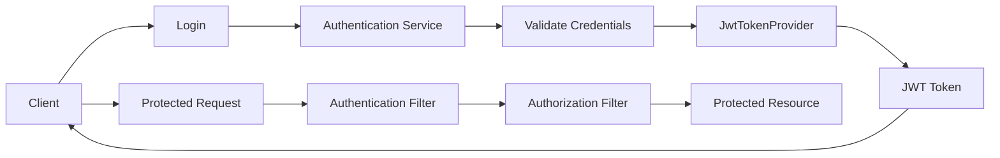

JWT functionality is provided through:

```text
security
└── crypto
    └── JwtTokenProvider
```

---

# 🛡️ Security Filters

AMS provides multiple HTTP security filters.

### Authentication Filter

Validates authenticated user sessions/tokens before protected requests are processed.

### Authorization Filter

Validates user roles and permissions before allowing access to protected resources.

### CORS Filter

Controls cross-origin requests.

### Rate Limiting Filter

Helps protect endpoints from excessive requests and abuse.

### Security Headers Filter

Adds security-related HTTP response headers to strengthen browser-side protection.

Security filters are organized under:

```text
security
└── filter
    ├── AuthenticationFilter
    ├── AuthorizationFilter
    ├── CorsFilter
    ├── RateLimitingFilter
    └── SecurityHeadersFilter
```

---

# 🏗️ High-Level System Architecture

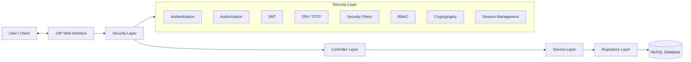

---

# 🔄 Request Processing Flow

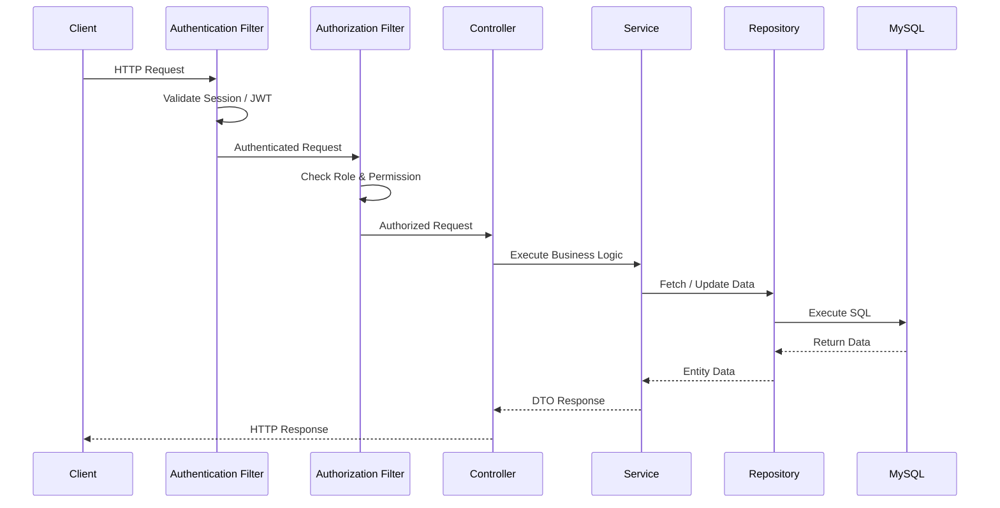

---

# 👥 User Management

AMS provides centralized user management.

### Features

* Create users
* Update users
* Delete users
* Activate / deactivate users
* Assign roles
* Manage user access
* Enable / disable 2FA
* Manage authentication credentials

---

# 🛡️ Role Management

AMS implements Role-Based Access Control.

### Features

* Create roles
* Update roles
* Delete roles
* Assign permissions to roles
* Manage role-based access

Example:

```text
Admin
 |
 ├── Manage Users
 ├── Manage Roles
 └── Manage Permissions


Manager
 |
 ├── Approve Requests
 └── View Reports


Employee
 |
 └── Assigned Resource Access
```

---

# 🔐 Permission Management

AMS provides fine-grained authorization through permissions.

### Features

* Create permissions
* Update permissions
* Delete permissions
* Assign permissions to roles
* Validate permissions
* Control resource-level access

Relationship:

```text
Role
  |
  ↓
Permission
  |
  ↓
Resource Access
```

---

# 👥 RBAC Design

AMS follows **Role-Based Access Control (RBAC)**.

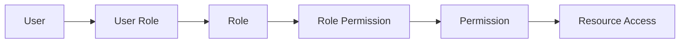

### RBAC Relationship

```text
User
  |
  ↓
User Role
  |
  ↓
Role
  |
  ↓
Role Permission
  |
  ↓
Permission
  |
  ↓
Resource Access
```

---

# 📩 Access Request Management

AMS provides controlled access request workflows.

### Features

* Submit access requests
* Track request status
* Request additional permissions
* Temporary access management
* Approval-based access provisioning

## Access Request Workflow

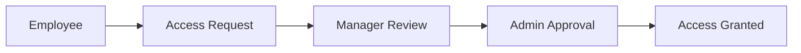

---

# ✅ Approval Workflow

AMS supports approval-based access management.

### Features

* Approve requests
* Reject requests
* Approval history
* Multi-level approval support
* Controlled access provisioning

## Approval Flow

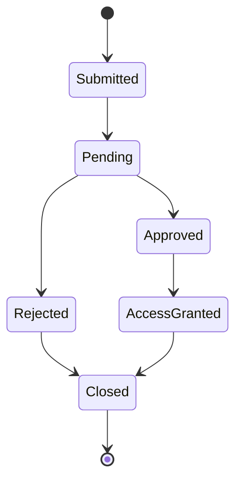

---

# 📋 Audit Management

AMS tracks important security activities for accountability and auditing.

### Tracks

* Login activities
* Permission changes
* Role changes
* Access requests
* Approval actions
* Security-related operations

Example:

```text
User:
John Smith

Action:
Permission Updated

Time:
2026-08-05

Status:
Successful
```

## Audit Logging Architecture

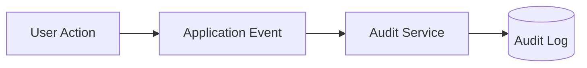

---

# 📊 Reporting System

AMS provides reporting capabilities for security and access management.

### Reports

* User access reports
* Role reports
* Permission reports
* Audit reports

---

# 🧩 Module Architecture

AMS is organized into independent business modules.

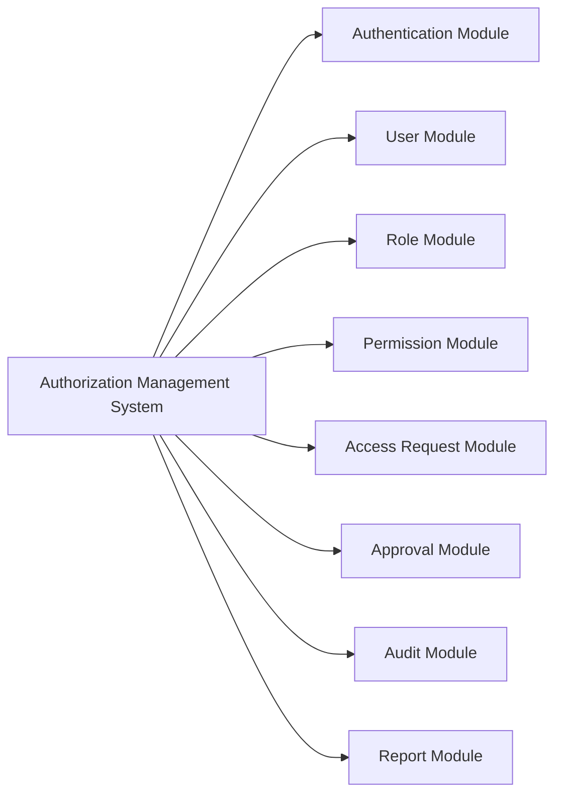

---

# 📦 Module Internal Structure

Each business module follows a consistent structure:

```text
Module

├── Controller
├── DTO
├── Entity
├── Mapper
├── Repository
├── Service
└── Validator
```

This structure improves:

* Separation of Concerns
* Maintainability
* Testability
* Module-level organization
* Code reusability

---

# 🔐 Security Architecture

```text
security
│
├── authentication
│
├── authorization
│
├── crypto
│   ├── HashUtils
│   ├── HmacUtils
│   └── JwtTokenProvider
│
├── filter
│   ├── AuthenticationFilter
│   ├── AuthorizationFilter
│   ├── CorsFilter
│   ├── RateLimitingFilter
│   └── SecurityHeadersFilter
│
├── password
│
├── rbac
│
├── session
│
└── twofactor
    ├── TOTPProvider
    └── TwoFactorAuthService
```

---

# 🛡️ Authorization Flow

After authentication, every protected request is validated through role and permission checks.

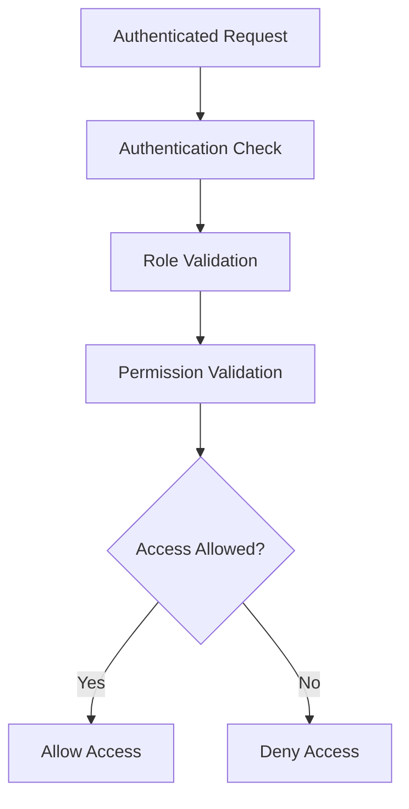

---

# 🗄️ Database Design

Main database modules include:

```text
users

roles

permissions

user_roles

role_permissions

access_request

approval

audit_log

password_reset_token
```

---

# 🗃️ Database Relationship Overview

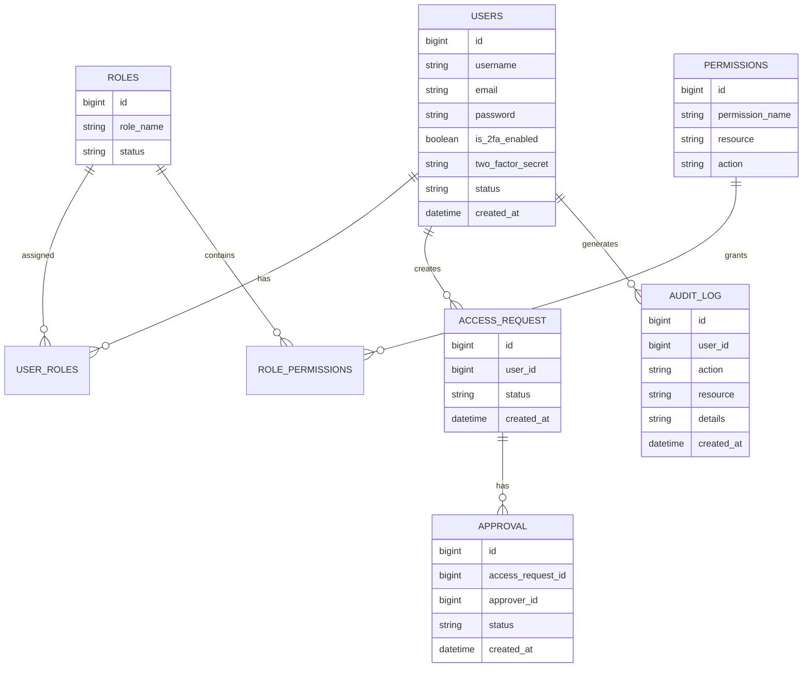

---

# 🗃️ Database Migration

AMS uses version-based database migrations.

Migration scripts are maintained under the migration package/directory.

```text
db.migration

├── V1__...
├── V2__...
├── V3__...
├── V4__...
├── V5__...
├── V6__...
├── V7__...
├── V8__...
├── V9__...
└── V10__...
```

The versioned migration structure provides a controlled approach for evolving the database schema.

---

# 📂 Project Structure

```text
com.ams

├── common
│   ├── constant
│   ├── enums
│   ├── exception
│   ├── util
│   └── validator
│
├── config
│
├── migration
│
├── modules
│   ├── auth
│   ├── user
│   ├── role
│   ├── permission
│   ├── accessrequest
│   ├── approval
│   ├── audit
│   └── report
│
└── security
    ├── authentication
    ├── authorization
    ├── crypto
    ├── filter
    ├── password
    ├── rbac
    ├── session
    └── twofactor
```

---

# 🌍 Real-World Applications

## 🏥 Healthcare Authorization System

Example:

```text
Hospital System


Doctor
 |
 ├── View Patient Records
 └── Update Prescription


Nurse
 |
 └── View Patient Information


Receptionist
 |
 └── Manage Appointment


Admin
 |
 └── Manage System Access
```

AMS can act as an authorization layer for healthcare applications where different staff members require different levels of access.

---

## 🏢 Enterprise Employee Access Management

Organizations can manage:

* Employee accounts
* Department access
* Internal applications
* Security policies
* Application permissions

---

## 💻 Application Authorization Service

AMS can work as an authorization layer for existing applications.

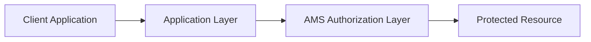

---

## ☁️ SaaS Authorization Platform

AMS can be extended into a multi-tenant authorization platform.

```text
AMS Platform
     |
     ├── Company A
     │    ├── Users
     │    ├── Roles
     │    └── Permissions
     │
     └── Company B
          ├── Users
          ├── Roles
          └── Permissions
```

Each organization can maintain its own security policies and access rules.

---

# 🛠️ Technologies Used

## Backend

* Java
* Servlet API
* JSP
* JDBC

## Database

* MySQL

## Frontend

* HTML
* CSS
* JavaScript
* Bootstrap

## Security

* BCrypt Password Hashing
* Session Authentication
* JWT Authentication
* RBAC Authorization
* TOTP / 2FA
* SHA-256
* HMAC-SHA256
* CORS Protection
* Rate Limiting
* Security Headers

## Tools

* Eclipse IDE
* Apache Tomcat
* Git
* Maven

---

# ⚙️ Installation & Setup

## 1. Clone Repository

```bash
git clone https://github.com/MotionPrograming/AuthorizationManagementSystem.git

cd AuthorizationManagementSystem
```

---

## 2. Database Setup

Create the MySQL database:

```sql
CREATE DATABASE authorization_management;
```

Configure the database connection:

```text
resources/db.properties
```

Example:

```properties
db.url=jdbc:mysql://localhost:3306/authorization_management
db.username=root
db.password=password
```

> For production deployments, database credentials should be supplied through secure environment-specific configuration rather than committed to source control.

---

## 3. Run Database Migration

Execute:

```text
MigrationRunner.java
```

The versioned migration scripts will create and update the required database schema.

---

## 4. Configure Application

Verify:

* MySQL connection
* Application configuration
* JWT configuration
* Security configuration
* Session configuration
* 2FA configuration

---

## 5. Deploy Application

Deploy the application using:

```text
Apache Tomcat Server
```

Then access:

```text
http://localhost:8080/AuthorizationManagementSystem
```

---

# 📌 Design Principles

This project follows:

* SOLID Principles
* Clean Code Practices
* Separation of Concerns
* Single Responsibility Principle
* Repository Pattern
* DTO Pattern
* Mapper Pattern
* Layered Architecture
* Feature-Based Architecture
* RBAC Pattern

---

# 🚀 Future Scalability Roadmap

The current AMS implementation provides a foundation for evolving into a more comprehensive IAM platform.

Future improvements include:

* REST API Support
* OAuth 2.0 Integration
* OpenID Connect (OIDC)
* Spring Boot Migration
* Microservices Architecture
* Redis Session Management
* Email Notification Service
* Multi-Tenant SaaS Architecture
* Cloud Deployment
* API Gateway Authorization
* Centralized Identity Provider
* Distributed Audit Processing
* Policy-Based Access Control (PBAC)

## Future Architecture

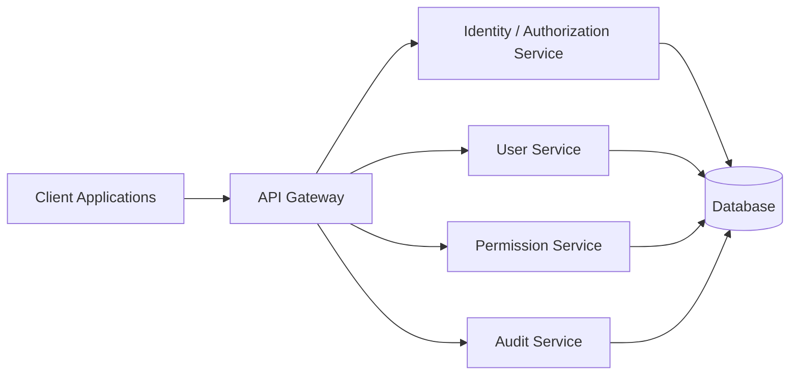

---

# 🎯 System Design Goals

The architecture focuses on:

* 🔐 Secure identity management
* 🛡️ Fine-grained authorization
* 🔑 Strong authentication
* 📱 Multi-factor authentication
* 👥 Role-based access control
* 📋 Security auditing
* 🔄 Controlled access workflows
* 🧩 Modular development
* 🛠️ Easy maintenance
* 📈 Enterprise scalability
* ♻️ Reusable authorization capabilities
* 🚀 Future microservice migration

---

# 👨‍💻 Author

**MD Abdullah Rajeb**

Backend Software Engineer

Interested in:

* Java
* C#
* ASP.NET Core
* Microservices
* Software Architecture
* Database Design

---

# 📄 License

This project is developed for **educational purposes and software engineering practice**.

```
