# 🔐 Authorization Management System (AMS)

> **Enterprise-oriented Identity, Authentication & Authorization Platform**

A modular Java-based Authorization Management System built with **Java Servlet, JSP, JDBC, and Oracle Database**, providing authentication, JWT, session security, TOTP-based 2FA, RBAC, fine-grained permissions, access-request workflows, approval management, audit logging, reporting, and a structured JSP-based user and administrator frontend.

---

## 📌 Overview

**Authorization Management System (AMS)** is designed as a reusable security and authorization platform for applications that require centralized identity, authentication, authorization, access management, and security auditing.

The system brings together:

* 🔑 Authentication
* 🎟️ JWT-based authentication
* 🛡️ Authorization
* 👥 Role-Based Access Control (RBAC)
* 🔐 Two-Factor Authentication (2FA)
* 📱 TOTP verification
* 🔑 Backup-code recovery
* 👤 User management
* 🧩 Fine-grained permission management
* 📩 Access-request workflows
* ✅ Approval workflows
* 📋 Security auditing
* 📊 Reporting
* 🔒 Session management
* 🚦 Rate limiting
* 🌐 CORS protection
* 🛡️ Security headers
* 🔏 Cryptographic utilities
* 🖥️ JSP-based user frontend
* ⚙️ JSP-based administrator frontend

The platform can be integrated with healthcare systems, ERP applications, SaaS platforms, enterprise applications, and internal management systems.

---

# 🚀 Project Vision

The goal of AMS is to provide a centralized platform for managing:

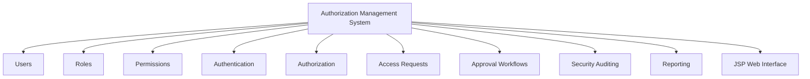

---

# ✨ Core Features

## 🔑 Authentication & Security

* Secure user authentication
* BCrypt password hashing
* Session-based authentication
* JWT authentication
* Authentication filter
* Authorization filter
* Password management
* Role-Based Access Control
* TOTP-based 2FA
* Backup-code recovery
* CORS protection
* Rate limiting
* Security headers
* SHA-256 hashing
* HMAC-SHA256 integrity protection
* Secure session management

---

## 👥 User Management

Administrators can manage:

* User accounts
* User profiles
* User status
* User roles
* User permissions
* Authentication credentials
* 2FA configuration
* Access requests

---

## 🧩 Permission Management

AMS supports fine-grained permission management.

Capabilities include:

* Create permissions
* Update permissions
* Delete permissions
* Assign permissions to roles
* Validate permissions
* Control resource-level access

A permission can conceptually represent:

```text
Resource + Action
```

Examples:

```text
USER + READ
USER + UPDATE
ROLE + CREATE
REPORT + VIEW
```

---

## 📩 Access Request Management

AMS provides controlled access-request workflows.

Features:

* Submit access requests
* Track request status
* Request additional permissions
* Temporary access management
* Approval-based access provisioning

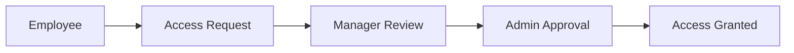

---

## ✅ Approval Workflow

AMS supports approval-based access management.

Features:

* Approve requests
* Reject requests
* Approval history
* Multi-level approval support
* Controlled access provisioning

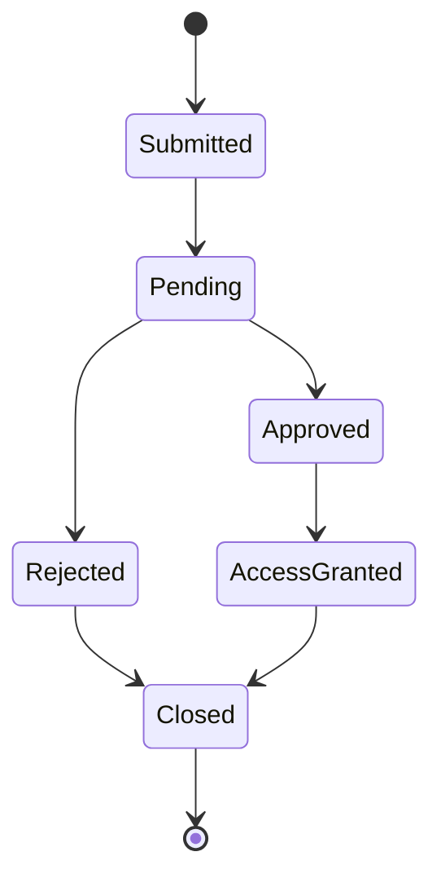

---

# 🖥️ Frontend Architecture

AMS provides a structured **JSP-based web frontend** divided into:

1. **User Frontend**
2. **Admin Frontend**
3. **Shared Components**
4. **Shared Layouts**

The frontend follows a feature-oriented JSP organization so that user-facing and administrator-facing interfaces remain separated.

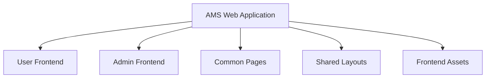

---

## 👤 User Frontend

The user frontend contains functionality available to authenticated application users.

```text
WEB-INF/views/user/
│
├── auth/
│   ├── login.jsp
│   ├── verify-2fa.jsp
│   ├── forgot-password.jsp
│   └── reset-password.jsp
│
├── dashboard.jsp
│
├── profile/
│   ├── profile.jsp
│   ├── security.jsp
│   └── change-password.jsp
│
└── access-request/
    ├── create.jsp
    ├── my-requests.jsp
    └── view.jsp
```

### User Frontend Responsibilities

#### Authentication

```text
login.jsp
verify-2fa.jsp
forgot-password.jsp
reset-password.jsp
```

Responsible for the user authentication and account-recovery interface.

#### Dashboard

```text
dashboard.jsp
```

Provides the main authenticated-user interface.

#### Profile & Security

```text
profile/profile.jsp
profile/security.jsp
profile/change-password.jsp
```

Provides:

* Profile management
* Security settings
* Password management
* Account security operations

#### Access Requests

```text
access-request/create.jsp
access-request/my-requests.jsp
access-request/view.jsp
```

Provides:

* Creating access requests
* Viewing submitted requests
* Tracking request status
* Viewing individual request details

---

# ⚙️ Admin Frontend

The administrator frontend provides management interfaces for users, roles, permissions, access requests, approvals, auditing, and reports.

```text
WEB-INF/views/admin/
│
├── dashboard.jsp
│
├── users/
│   ├── list.jsp
│   ├── create.jsp
│   ├── edit.jsp
│   └── view.jsp
│
├── roles/
│   ├── list.jsp
│   ├── create.jsp
│   ├── edit.jsp
│   └── permissions.jsp
│
├── permissions/
│   ├── list.jsp
│   ├── create.jsp
│   ├── edit.jsp
│   └── view.jsp
│
├── access-request/
│   ├── list.jsp
│   └── view.jsp
│
├── approval/
│   ├── pending.jsp
│   ├── view.jsp
│   └── history.jsp
│
├── audit/
│   ├── logs.jsp
│   └── view.jsp
│
└── report/
    ├── dashboard.jsp
    ├── users.jsp
    ├── roles.jsp
    ├── permissions.jsp
    └── audit.jsp
```

---

## 👥 Admin User Management

```text
users/
├── list.jsp
├── create.jsp
├── edit.jsp
└── view.jsp
```

Provides interfaces for:

* Listing users
* Creating users
* Editing users
* Viewing user details
* Managing user accounts

---

## 👥 Admin Role Management

```text
roles/
├── list.jsp
├── create.jsp
├── edit.jsp
└── permissions.jsp
```

Provides:

* Role listing
* Role creation
* Role editing
* Role-permission management

---

## 🔐 Admin Permission Management

```text
permissions/
├── list.jsp
├── create.jsp
├── edit.jsp
└── view.jsp
```

Provides:

* Permission listing
* Permission creation
* Permission editing
* Permission details

---

## 📩 Admin Access Requests

```text
access-request/
├── list.jsp
└── view.jsp
```

Administrators can review access requests and inspect individual request details.

---

## ✅ Admin Approval Management

```text
approval/
├── pending.jsp
├── view.jsp
└── history.jsp
```

Provides:

* Pending approvals
* Approval details
* Approval history

---

## 📋 Admin Audit Management

```text
audit/
├── logs.jsp
└── view.jsp
```

Provides:

* Security audit log listing
* Individual audit-log details

---

## 📊 Admin Reporting

```text
report/
├── dashboard.jsp
├── users.jsp
├── roles.jsp
├── permissions.jsp
└── audit.jsp
```

Provides reporting interfaces for:

* Users
* Roles
* Permissions
* Audit activity
* Overall reporting dashboard

---

# 🧩 Shared Frontend Components

Shared pages are stored under:

```text
WEB-INF/views/common/
```

Structure:

```text
common/
├── error.jsp
├── access-denied.jsp
├── not-found.jsp
└── loading.jsp
```

### Common Pages

| Page                | Purpose                         |
| ------------------- | ------------------------------- |
| `error.jsp`         | General application error page  |
| `access-denied.jsp` | Unauthorized/access-denied page |
| `not-found.jsp`     | Resource-not-found page         |
| `loading.jsp`       | Loading state/interface         |

These pages can be reused across user and administrator flows.

---

# 🎨 Shared UI Layouts

Shared JSP layouts are stored under:

```text
WEB-INF/views/layouts/
```

Structure:

```text
layouts/
├── user.jsp
├── admin.jsp
├── header.jsp
├── navbar.jsp
├── sidebar.jsp
└── footer.jsp
```

### Layout Responsibilities

| Layout        | Responsibility                     |
| ------------- | ---------------------------------- |
| `user.jsp`    | Main user frontend layout          |
| `admin.jsp`   | Main administrator frontend layout |
| `header.jsp`  | Shared page header                 |
| `navbar.jsp`  | Navigation interface               |
| `sidebar.jsp` | Sidebar navigation                 |
| `footer.jsp`  | Shared footer                      |

This structure helps avoid duplicating common UI markup across JSP pages.

---

# 🎨 Frontend Assets

Static frontend resources are stored under:

```text
src/main/webapp/assets/
```

Structure:

```text
assets/
├── css/
├── js/
├── images/
└── icons/
```

### CSS

```text
assets/css/
```

Contains application styling and UI styles.

### JavaScript

```text
assets/js/
```

Contains client-side JavaScript functionality.

### Images

```text
assets/images/
```

Contains frontend images and visual resources.

### Icons

```text
assets/icons/
```

Contains application icons and UI icon resources.

---

# 🗂️ Complete Web Application Structure

The complete JSP web application structure is:

```text
src/main/webapp/
│
├── assets/
│   ├── css/
│   ├── js/
│   ├── images/
│   └── icons/
│
├── META-INF/
│
├── WEB-INF/
│   ├── lib/
│   │
│   └── views/
│       │
│       ├── user/
│       │   ├── auth/
│       │   │   ├── login.jsp
│       │   │   ├── verify-2fa.jsp
│       │   │   ├── forgot-password.jsp
│       │   │   └── reset-password.jsp
│       │   │
│       │   ├── dashboard.jsp
│       │   │
│       │   ├── profile/
│       │   │   ├── profile.jsp
│       │   │   ├── security.jsp
│       │   │   └── change-password.jsp
│       │   │
│       │   └── access-request/
│       │       ├── create.jsp
│       │       ├── my-requests.jsp
│       │       └── view.jsp
│       │
│       ├── admin/
│       │   ├── dashboard.jsp
│       │   │
│       │   ├── users/
│       │   │   ├── list.jsp
│       │   │   ├── create.jsp
│       │   │   ├── edit.jsp
│       │   │   └── view.jsp
│       │   │
│       │   ├── roles/
│       │   │   ├── list.jsp
│       │   │   ├── create.jsp
│       │   │   ├── edit.jsp
│       │   │   └── permissions.jsp
│       │   │
│       │   ├── permissions/
│       │   │   ├── list.jsp
│       │   │   ├── create.jsp
│       │   │   ├── edit.jsp
│       │   │   └── view.jsp
│       │   │
│       │   ├── access-request/
│       │   │   ├── list.jsp
│       │   │   └── view.jsp
│       │   │
│       │   ├── approval/
│       │   │   ├── pending.jsp
│       │   │   ├── view.jsp
│       │   │   └── history.jsp
│       │   │
│       │   ├── audit/
│       │   │   ├── logs.jsp
│       │   │   └── view.jsp
│       │   │
│       │   └── report/
│       │       ├── dashboard.jsp
│       │       ├── users.jsp
│       │       ├── roles.jsp
│       │       ├── permissions.jsp
│       │       └── audit.jsp
│       │
│       ├── common/
│       │   ├── error.jsp
│       │   ├── access-denied.jsp
│       │   ├── not-found.jsp
│       │   └── loading.jsp
│       │
│       └── layouts/
│           ├── user.jsp
│           ├── admin.jsp
│           ├── header.jsp
│           ├── navbar.jsp
│           ├── sidebar.jsp
│           └── footer.jsp
│
└── index.jsp
```

---

# 🔐 Authentication Architecture

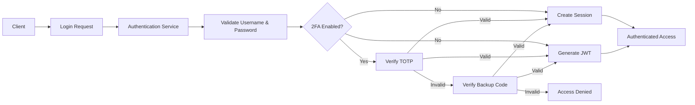

---

# 🎟️ JWT Authentication

AMS supports **JSON Web Token (JWT)** authentication for protected application requests.

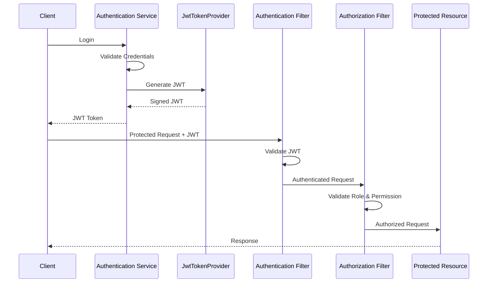

JWT functionality is provided through:

```text
security
└── crypto
    └── JwtTokenProvider
```

---

# 🔐 Two-Factor Authentication

AMS implements **TOTP-based Two-Factor Authentication**.

Compatible authenticator applications include:

* Google Authenticator
* Authy
* Other TOTP-compatible applications

## 2FA Endpoints

| Method | Endpoint                  | Purpose                          |
| ------ | ------------------------- | -------------------------------- |
| POST   | `/api/v1/auth/2fa/setup`  | Generate TOTP secret and QR code |
| POST   | `/api/v1/auth/2fa/enable` | Verify OTP and enable 2FA        |
| POST   | `/api/v1/auth/2fa/verify` | Verify OTP during authentication |

## 2FA Components

```text
security
└── twofactor
    ├── BackupCodeManager
    ├── TOTPProvider
    ├── TwoFactorAuthService
    └── TwoFactorResponse
```

The `USERS` table supports 2FA through:

```text
IS_2FA_ENABLED
TWO_FACTOR_SECRET
```

---

# 🔒 Cryptography & Data Integrity

AMS includes cryptographic utilities for authentication, integrity, and secure token operations.

| Mechanism   | Purpose                                |
| ----------- | -------------------------------------- |
| BCrypt      | Password hashing                       |
| SHA-256     | Cryptographic hashing / fingerprinting |
| HMAC-SHA256 | Integrity and authenticity protection  |
| JWT signing | Token authentication                   |

---

# 🛡️ Security Filters

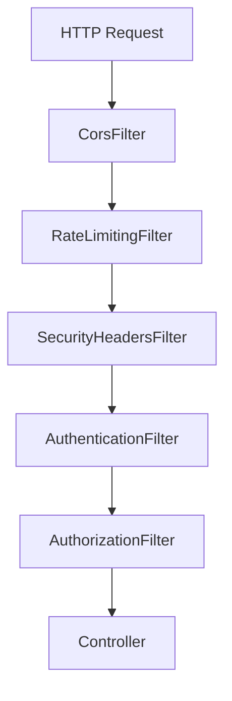

### Authentication Filter

Validates authenticated sessions or tokens before protected requests are processed.

### Authorization Filter

Validates roles and permissions before allowing access to protected resources.

### CORS Filter

Controls cross-origin HTTP requests.

### Rate Limiting Filter

Helps protect endpoints from excessive requests and abuse.

### Security Headers Filter

Adds security-related HTTP response headers.

---

# 👥 Role-Based Access Control (RBAC)

AMS follows a layered RBAC model.

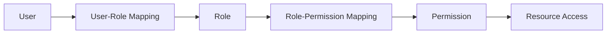

---

# 📋 Audit Management

AMS tracks security-sensitive activities for accountability.

Audited activities include:

* Login activities
* Permission changes
* Role changes
* Access requests
* Approval actions
* 2FA setup
* 2FA enablement
* 2FA verification
* Other security-related operations

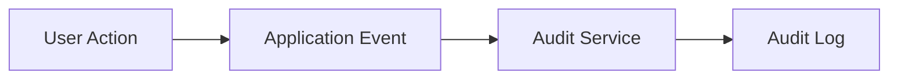

---

# 📊 Reporting System

AMS provides reporting capabilities for access and security management.

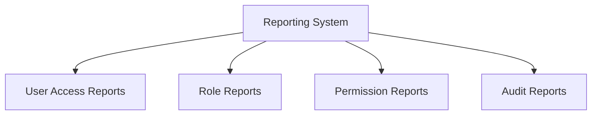

---

# 🔒 Session Management

Session management is isolated inside the security layer.

```text
security
└── session
    └── SessionManager
```

---

# 🏗️ High-Level Architecture

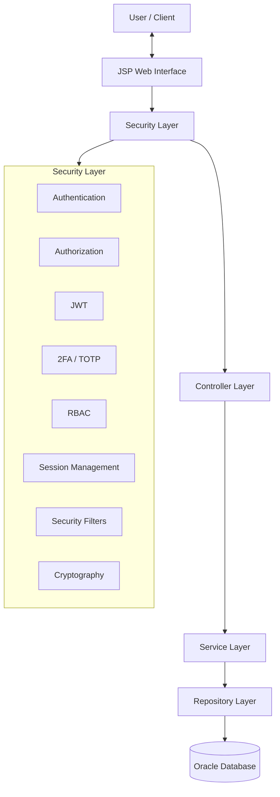

---

# 🔄 Request Processing Flow

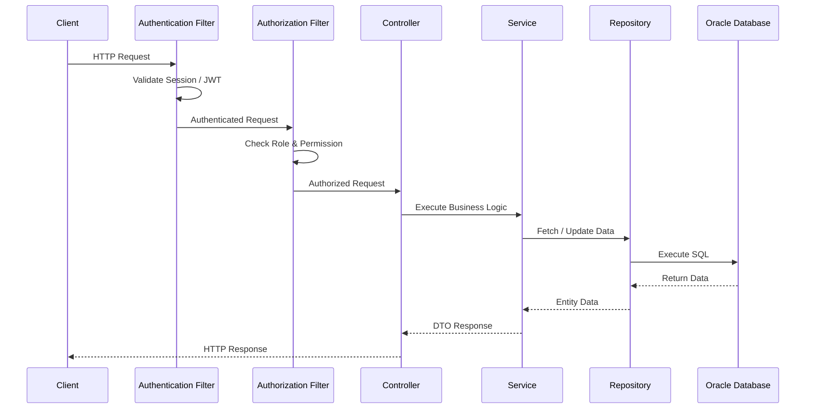

---

# 🧩 Module Architecture

AMS is organized around independent business modules.

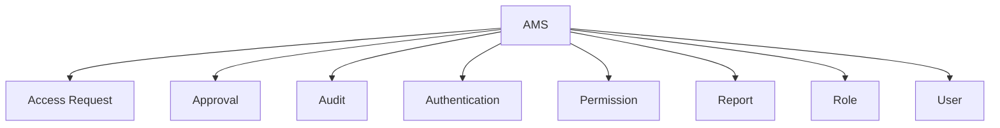

---

# 📦 Module Internal Structure

Each business module follows a consistent structure:

```text
Module
├── Controller
├── DTO
├── Entity
├── Mapper
├── Repository
├── Service
└── Validator
```

This structure supports:

* Separation of Concerns
* Maintainability
* Testability
* Module-level organization
* Code reusability

---

# 🛡️ Security Architecture

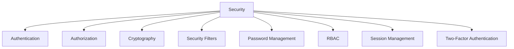

---

# 🗂️ Backend Project Structure

```text
com.ams
│
├── common
│   ├── constant
│   ├── enums
│   ├── exception
│   ├── util
│   └── validator
│       ├── CommonValidator
│       ├── EmailValidator
│       ├── PasswordValidator
│       └── PhoneValidator
│
├── config
├── migration
│
├── modules
│   ├── accessrequest
│   ├── approval
│   ├── audit
│   ├── auth
│   ├── permission
│   ├── report
│   ├── role
│   └── user
│
└── security
    ├── authentication
    ├── authorization
    ├── crypto
    │   ├── HashUtils
    │   ├── HmacUtils
    │   └── JwtTokenProvider
    ├── filter
    │   ├── AuthenticationFilter
    │   ├── AuthorizationFilter
    │   ├── CorsFilter
    │   ├── RateLimitingFilter
    │   └── SecurityHeadersFilter
    ├── password
    ├── rbac
    │   └── RBACManager
    ├── session
    │   └── SessionManager
    └── twofactor
        ├── BackupCodeManager
        ├── TOTPProvider
        ├── TwoFactorAuthService
        └── TwoFactorResponse
```

---

# 🗄️ Database Architecture

The primary database is **Oracle Database**.

## Main Tables

```text
USERS
ROLES
PERMISSIONS
USER_ROLES
ROLE_PERMISSIONS
ACCESS_REQUEST
APPROVAL
AUDIT_LOG
PASSWORD_RESET_TOKEN
```

---

# 🛠️ Technologies

## Backend

* Java
* Servlet API
* JSP
* JDBC

## Frontend

* JSP
* HTML
* CSS
* JavaScript
* Bootstrap

## Database

* Oracle Database
* Oracle JDBC Driver

## Security

* BCrypt
* Session Authentication
* JWT
* RBAC
* TOTP / 2FA
* Backup Codes
* SHA-256
* HMAC-SHA256
* CORS Protection
* Rate Limiting
* Security Headers

## Tools

* Eclipse IDE
* Apache Tomcat
* Git
* Maven

---

# ⚙️ Installation & Setup

## 1. Clone Repository

```bash
git clone https://github.com/MotionPrograming/AuthorizationManagementSystem.git
cd AuthorizationManagementSystem
```

## 2. Configure Oracle Database

Install and configure an Oracle Database instance.

Create a dedicated Oracle user/schema for AMS.

Example:

```sql
CREATE USER ams_user IDENTIFIED BY password;

GRANT CONNECT, RESOURCE TO ams_user;
```

The exact privileges should be adjusted according to the Oracle environment and deployment requirements.

---

## 3. Configure Database Connection

Configure:

```text
resources/db.properties
```

Example:

```properties
db.url=jdbc:oracle:thin:@localhost:1521/XEPDB1
db.username=ams_user
db.password=password
```

---

## 4. Configure Oracle JDBC Driver

Example Maven dependency:

```xml
<dependency>
    <groupId>com.oracle.database.jdbc</groupId>
    <artifactId>ojdbc11</artifactId>
    <version>23.8.0.25.04</version>
</dependency>
```

Use the JDBC driver version compatible with the Java version and Oracle environment used by the project.

---

## 5. Run Database Migration

Execute:

```text
MigrationRunner.java
```

The versioned migration scripts will create and update the required Oracle database schema.

---

## 6. Configure Application

Verify:

* Oracle database connection
* Oracle JDBC driver
* Application configuration
* JWT configuration
* Security configuration
* Session configuration
* 2FA configuration
* Frontend/JSP configuration

---

## 7. Deploy

Deploy the application to:

```text
Apache Tomcat Server
```

Default application URL:

```text
http://localhost:8080/AuthorizationManagementSystem
```

---

# 🧠 Design Principles

The project follows:

* SOLID Principles
* Clean Code Practices
* Separation of Concerns
* Single Responsibility Principle
* Repository Pattern
* DTO Pattern
* Mapper Pattern
* Layered Architecture
* Feature-Based Architecture
* RBAC Pattern

---

# 🚀 Scalability Roadmap

Future improvements include:

* REST API support
* OAuth 2.0 integration
* OpenID Connect (OIDC)
* Spring Boot migration
* Microservices architecture
* Redis session management
* Email notification service
* Multi-tenant SaaS architecture
* Cloud deployment
* API Gateway authorization
* Centralized Identity Provider
* Distributed audit processing
* Policy-Based Access Control (PBAC)

---

# 🔭 Future Architecture

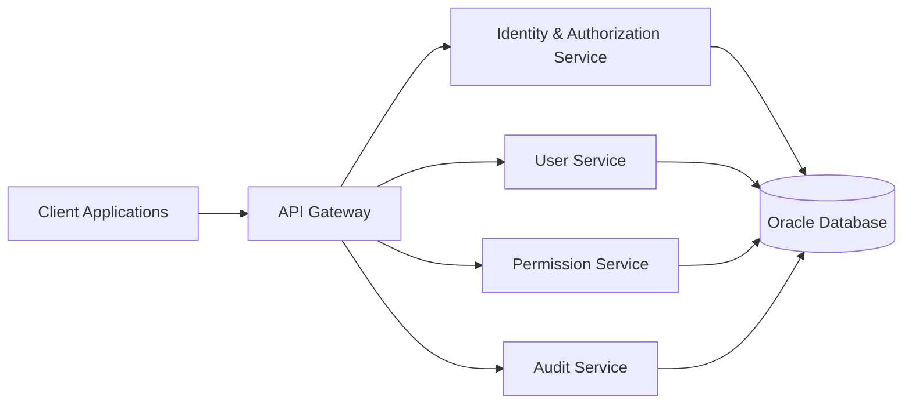

---

# 🎯 System Design Goals

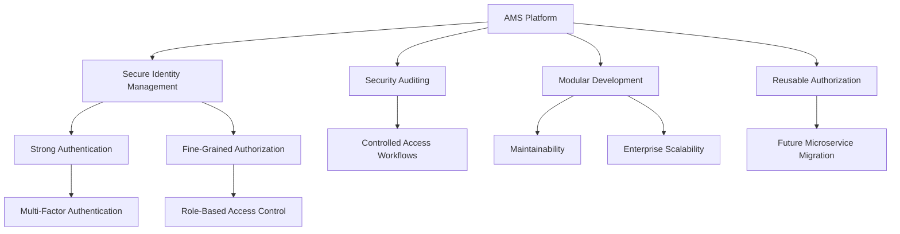

---

# 📈 Security & Authorization Flow

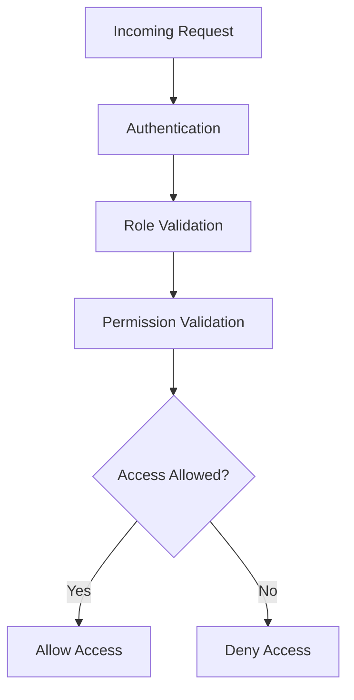

---

# 🔐 Security Responsibility Map

| Component              | Responsibility                  |
| ---------------------- | ------------------------------- |
| `AuthenticationFilter` | Authenticate protected requests |
| `AuthorizationFilter`  | Validate authorization          |
| `RBACManager`          | Manage RBAC decisions           |
| `SessionManager`       | Manage application sessions     |
| `JwtTokenProvider`     | JWT creation/validation         |
| `TOTPProvider`         | TOTP operations                 |
| `BackupCodeManager`    | Backup-code management          |
| `TwoFactorAuthService` | 2FA orchestration               |
| `HashUtils`            | Cryptographic hashing           |
| `HmacUtils`            | HMAC integrity protection       |

---

# 📌 Architecture Summary

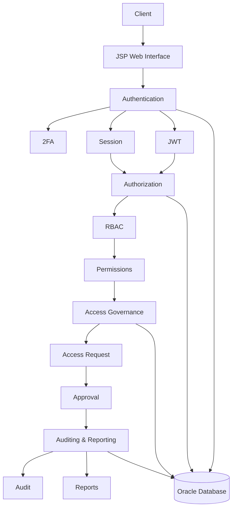

---

# 👨‍💻 Author

**Md. Abdullah**

Backend Software Engineer

### Interests

* Java
* C#
* ASP.NET Core
* Microservices
* Software Architecture
* Database Design

### Contact

**GitHub:** [github.com/MotionPrograming](https://github.com/MotionPrograming)

---

# 📄 License

This project is developed for **educational purposes and software engineering practice**.
