# 🔐 Authorization Management System (AMS)

> **Enterprise-oriented Identity, Authentication & Authorization Platform**

A modular Java-based Authorization Management System built with **Java Servlet, JSP, JDBC, Oracle Database, JavaScript, and Bootstrap 5**, providing authentication, JWT, session security, TOTP-based 2FA, RBAC, fine-grained permissions, access-request workflows, approval management, audit logging, reporting, and a **JavaScript-based Single Page Application (SPA) frontend**.

---

## 📌 Overview

**Authorization Management System (AMS)** is designed as a reusable security and authorization platform for applications that require centralized identity, authentication, authorization, access management, and security auditing.

The system brings together:

* 🔑 Authentication
* 🎟️ JWT-based authentication
* 🛡️ Authorization
* 👥 Role-Based Access Control (RBAC)
* 🔐 Two-Factor Authentication (2FA)
* 📱 TOTP verification
* 🔑 Backup-code recovery
* 👤 User management
* 🧩 Fine-grained permission management
* 📩 Access-request workflows
* ✅ Approval workflows
* 📋 Security auditing
* 📊 Reporting
* 🔒 Session management
* 🚦 Rate limiting
* 🌐 CORS protection
* 🛡️ Security headers
* 🔏 Cryptographic utilities
* 🖥️ JSP-based SPA frontend
* ⚙️ User and administrator interfaces

The platform can be integrated with healthcare systems, ERP applications, SaaS platforms, enterprise applications, and internal management systems.

---

# 🚀 Project Vision

The goal of AMS is to provide a centralized platform for managing:

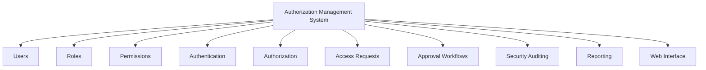

---

# ✨ Core Features

## 🔑 Authentication & Security

* Secure user authentication
* BCrypt password hashing
* Session-based authentication
* JWT authentication
* Authentication filter
* Authorization filter
* Password management
* Role-Based Access Control
* TOTP-based 2FA
* Backup-code recovery
* CORS protection
* Rate limiting
* Security headers
* SHA-256 hashing
* HMAC-SHA256 integrity protection
* Secure session management

---

## 👥 User Management

Administrators can manage:

* User accounts
* User profiles
* User status
* User roles
* User permissions
* Authentication credentials
* 2FA configuration
* Access requests

---

## 🧩 Permission Management

AMS supports fine-grained permission management.

Capabilities include:

* Create permissions
* Update permissions
* Delete permissions
* Assign permissions to roles
* Validate permissions
* Control resource-level access

A permission can conceptually represent:

```text
Resource + Action
```

Examples:

```text
USER + READ
USER + UPDATE
ROLE + CREATE
REPORT + VIEW
```

---

## 📩 Access Request Management

AMS provides controlled access-request workflows.

Features:

* Submit access requests
* Track request status
* Request additional permissions
* Temporary access management
* Approval-based access provisioning

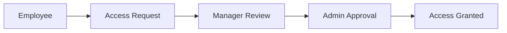

---

## ✅ Approval Workflow

AMS supports approval-based access management.

Features:

* Approve requests
* Reject requests
* Approval history
* Multi-level approval support
* Controlled access provisioning

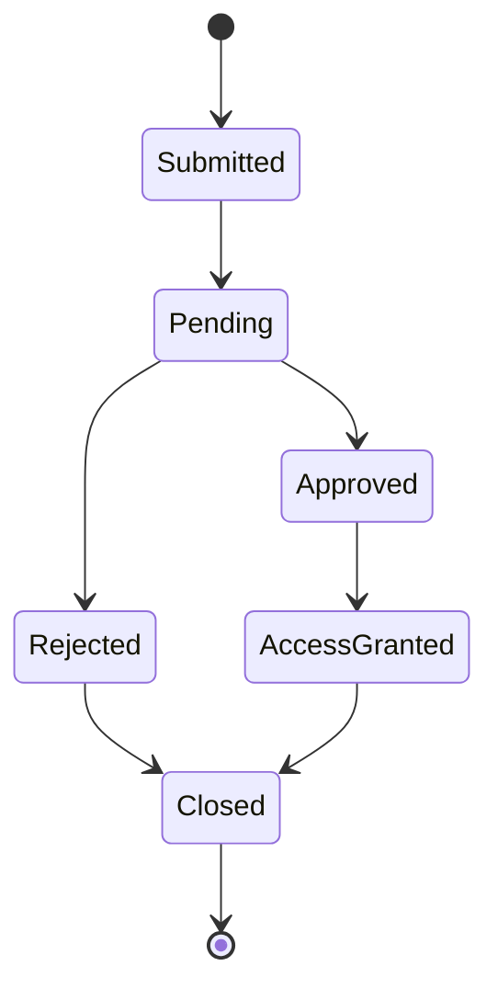

---

# 🖥️ Frontend Architecture

AMS uses a **JSP-based Single Page Application (SPA) architecture** enhanced with modern JavaScript and Bootstrap.

The frontend combines:

* JSP
* HTML5
* CSS3
* JavaScript ES6+
* Bootstrap 5
* Fetch API
* Client-side routing
* DOM-based rendering

The backend remains responsible for authentication, authorization, business logic, database operations, and API responses.

The SPA frontend communicates with the existing backend through HTTP requests without requiring changes to the backend architecture.

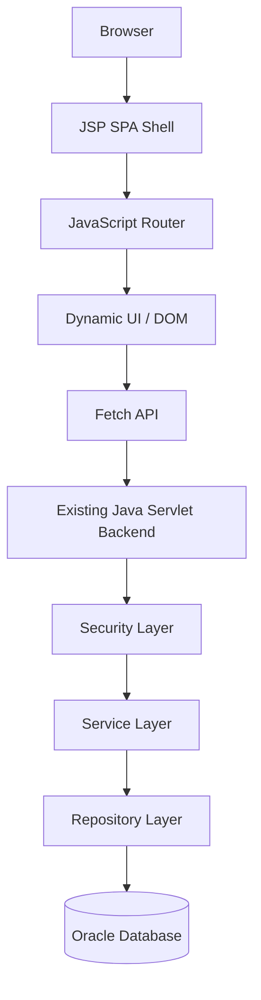

---

# 🧭 SPA Architecture

The application uses a **single application shell** after authentication.

The main application is loaded through:

```text
WEB-INF/views/app.jsp
```

JavaScript controls navigation and dynamically displays the required frontend view.

Example client-side routes:

```text
#/dashboard
#/profile
#/security
#/change-password
#/access-requests
#/users
#/roles
#/permissions
#/approvals
#/audit
#/reports
```

Navigation does not require a complete browser page reload.

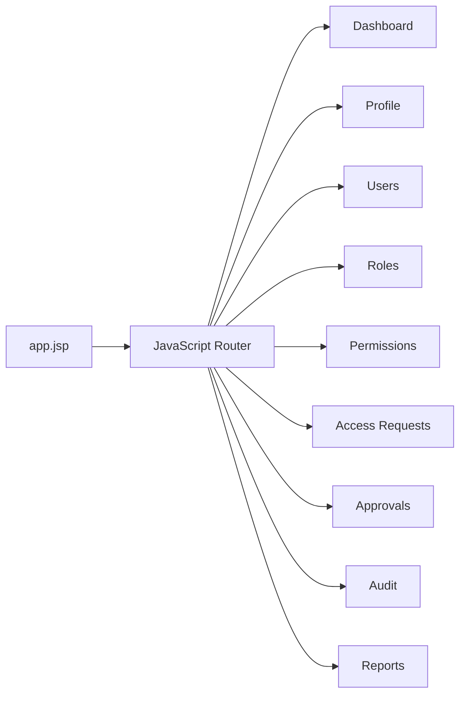

---

# 📁 Frontend Source Structure

The complete frontend structure is:

```text
src/main/webapp/
│
├── assets/
│   ├── css/
│   │   ├── app.css
│   │   ├── auth.css
│   │   ├── dashboard.css
│   │   └── admin.css
│   │
│   ├── js/
│   │   ├── common/
│   │   │   ├── router.js
│   │   │   ├── api-client.js
│   │   │   ├── auth.js
│   │   │   ├── notifications.js
│   │   │   ├── modal.js
│   │   │   └── utils.js
│   │   │
│   │   ├── auth/
│   │   │   ├── login.js
│   │   │   ├── two-factor.js
│   │   │   ├── forgot-password.js
│   │   │   └── reset-password.js
│   │   │
│   │   ├── user/
│   │   │   ├── dashboard.js
│   │   │   ├── profile.js
│   │   │   ├── security.js
│   │   │   ├── change-password.js
│   │   │   └── access-request.js
│   │   │
│   │   └── admin/
│   │       ├── dashboard.js
│   │       ├── users.js
│   │       ├── roles.js
│   │       ├── permissions.js
│   │       ├── access-requests.js
│   │       ├── approvals.js
│   │       ├── audit.js
│   │       └── reports.js
│   │
│   ├── images/
│   └── icons/
│
├── META-INF/
│
├── WEB-INF/
│   ├── lib/
│   │
│   └── views/
│       ├── app.jsp
│       ├── login.jsp
│       │
│       └── partials/
│           ├── dashboard.jsp
│           ├── profile.jsp
│           ├── security.jsp
│           ├── change-password.jsp
│           ├── access-request.jsp
│           ├── users.jsp
│           ├── roles.jsp
│           ├── permissions.jsp
│           ├── access-requests.jsp
│           ├── approvals.jsp
│           ├── audit.jsp
│           └── reports.jsp
│
└── index.jsp
```

---

# 🧩 SPA Frontend Components

## Application Shell

```text
WEB-INF/views/app.jsp
```

The application shell provides the main authenticated application structure.

It contains:

* Navigation
* Sidebar
* Header
* Main content container
* Footer
* Global UI containers
* JavaScript application entry point

The main content area is controlled by the JavaScript router.

---

## 🔐 Authentication Page

```text
WEB-INF/views/login.jsp
```

The login interface is responsible for:

* Username/email input
* Password input
* Login submission
* Client-side validation
* Authentication request
* Authentication error handling
* Navigation into the authenticated SPA

Additional authentication functionality is implemented through:

```text
assets/js/auth/
├── login.js
├── two-factor.js
├── forgot-password.js
└── reset-password.js
```

---

# 👤 User Frontend

User functionality is implemented as SPA routes and JavaScript modules.

```text
assets/js/user/
├── dashboard.js
├── profile.js
├── security.js
├── change-password.js
└── access-request.js
```

Corresponding JSP partial views:

```text
WEB-INF/views/partials/
├── dashboard.jsp
├── profile.jsp
├── security.jsp
├── change-password.jsp
└── access-request.jsp
```

### User Features

#### Dashboard

```text
#/dashboard
```

Provides:

* User overview
* Account information
* Access information
* Security status
* Application activity

#### Profile

```text
#/profile
```

Provides:

* Profile information
* Account details
* Profile management

#### Security

```text
#/security
```

Provides:

* 2FA status
* Security settings
* Authentication-related information

#### Change Password

```text
#/change-password
```

Provides:

* Current password validation
* New password entry
* Password confirmation
* Password update

#### Access Requests

```text
#/access-requests
```

Provides:

* Creating access requests
* Viewing submitted requests
* Tracking request status
* Viewing request details

---

# ⚙️ Admin Frontend

Administrator functionality is implemented through dedicated JavaScript modules and SPA views.

```text
assets/js/admin/
├── dashboard.js
├── users.js
├── roles.js
├── permissions.js
├── access-requests.js
├── approvals.js
├── audit.js
└── reports.js
```

Corresponding JSP partial views:

```text
WEB-INF/views/partials/
├── dashboard.jsp
├── users.jsp
├── roles.jsp
├── permissions.jsp
├── access-requests.jsp
├── approvals.jsp
├── audit.jsp
└── reports.jsp
```

---

## 👥 Admin User Management

Route:

```text
#/users
```

JavaScript:

```text
assets/js/admin/users.js
```

Provides interfaces for:

* Listing users
* Creating users
* Editing users
* Viewing user details
* Managing user accounts
* Managing user status

---

## 👥 Admin Role Management

Route:

```text
#/roles
```

JavaScript:

```text
assets/js/admin/roles.js
```

Provides:

* Role listing
* Role creation
* Role editing
* Role-permission management

---

## 🔐 Admin Permission Management

Route:

```text
#/permissions
```

JavaScript:

```text
assets/js/admin/permissions.js
```

Provides:

* Permission listing
* Permission creation
* Permission editing
* Permission details
* Permission management

---

## 📩 Admin Access Requests

Route:

```text
#/access-requests
```

JavaScript:

```text
assets/js/admin/access-requests.js
```

Provides:

* Access-request listing
* Request filtering
* Request details
* Request status management

---

## ✅ Admin Approval Management

Route:

```text
#/approvals
```

JavaScript:

```text
assets/js/admin/approvals.js
```

Provides:

* Pending approvals
* Approval details
* Approval actions
* Approval history

---

## 📋 Admin Audit Management

Route:

```text
#/audit
```

JavaScript:

```text
assets/js/admin/audit.js
```

Provides:

* Security audit-log listing
* Audit filtering
* Individual audit details
* Security activity inspection

---

## 📊 Admin Reporting

Route:

```text
#/reports
```

JavaScript:

```text
assets/js/admin/reports.js
```

Provides reporting interfaces for:

* Users
* Roles
* Permissions
* Audit activity
* Overall reporting

---

# 🧩 Shared Frontend JavaScript

Shared frontend functionality is organized under:

```text
assets/js/common/
```

## Router

```text
router.js
```

Responsible for:

* Client-side navigation
* Route detection
* View switching
* Browser history handling
* SPA navigation state

Example routes:

```text
#/dashboard
#/profile
#/users
#/roles
#/permissions
#/audit
```

---

## API Client

```text
api-client.js
```

Provides centralized HTTP communication with the existing backend.

Responsibilities include:

* GET requests
* POST requests
* PUT requests
* DELETE requests
* Request headers
* Authentication handling
* JSON response processing
* Error handling

The API client prevents individual modules from duplicating HTTP request logic.

---

## Authentication

```text
auth.js
```

Responsible for frontend authentication state and authentication-related UI behavior.

---

## Notifications

```text
notifications.js
```

Provides reusable UI notifications such as:

* Success messages
* Error messages
* Warning messages
* Informational messages

---

## Modal

```text
modal.js
```

Provides reusable Bootstrap modal behavior for:

* Confirmation dialogs
* Form dialogs
* Detail views
* Destructive-action confirmation

---

## Utilities

```text
utils.js
```

Contains reusable frontend helper functions.

---

# 🎨 Frontend CSS

Custom CSS is organized under:

```text
assets/css/
├── app.css
├── auth.css
├── dashboard.css
└── admin.css
```

### `app.css`

Contains:

* Global styles
* Typography
* Shared layout styles
* Common utility styles
* Global application components

### `auth.css`

Contains:

* Login styling
* Authentication forms
* 2FA interface
* Password recovery interface

### `dashboard.css`

Contains:

* Dashboard layouts
* Statistic cards
* Dashboard widgets
* User dashboard styling

### `admin.css`

Contains:

* Admin layouts
* Data tables
* Management interfaces
* Admin-specific components

---

# 🎨 Bootstrap 5

Bootstrap 5 is used for:

* Responsive layouts
* Navigation
* Forms
* Buttons
* Cards
* Tables
* Modals
* Alerts
* Dropdowns
* Pagination
* Responsive utilities

Custom project styling is maintained separately under:

```text
assets/css/
```

---

# 🔄 Frontend Request Flow

The SPA frontend communicates with the existing backend through Fetch API.

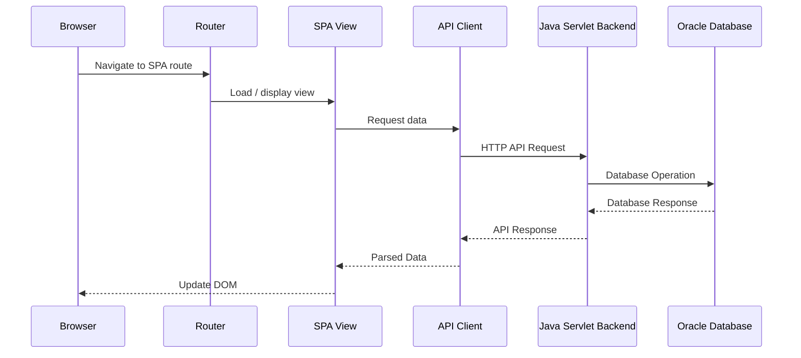

---

# 🚫 Backend Boundary

The SPA frontend does **not** require changes to the existing backend architecture.

The following backend components remain unchanged:

```text
Java Servlet
JDBC
Oracle Database
Service Layer
Repository Layer
Security Filters
Authentication
Authorization
RBAC
JWT
Session Management
2FA
Audit
```

The frontend consumes the existing backend functionality through its existing HTTP interfaces.

```text
Frontend SPA
     │
     │ HTTP / Fetch API
     ▼
Existing Backend
     │
     ▼
Existing Database
```

---

# 🧭 Client-Side Navigation

The frontend uses hash-based navigation to avoid requiring new server-side routes for every SPA screen.

Examples:

```text
#/dashboard
#/profile
#/security
#/change-password
#/access-requests
#/users
#/roles
#/permissions
#/approvals
#/audit
#/reports
```

The browser initially loads the application shell, and JavaScript controls subsequent navigation.

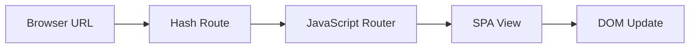

---

# 📱 Responsive Design

The frontend is designed to work across:

* Desktop
* Laptop
* Tablet
* Mobile

Bootstrap 5 responsive utilities are combined with custom CSS to provide responsive:

* Navigation
* Sidebar
* Forms
* Tables
* Cards
* Dashboards
* Modals

---

# 🔒 Authentication Architecture

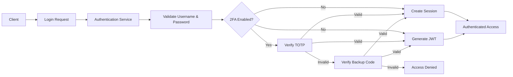

---

# 🎟️ JWT Authentication

AMS supports **JSON Web Token (JWT)** authentication for protected application requests.

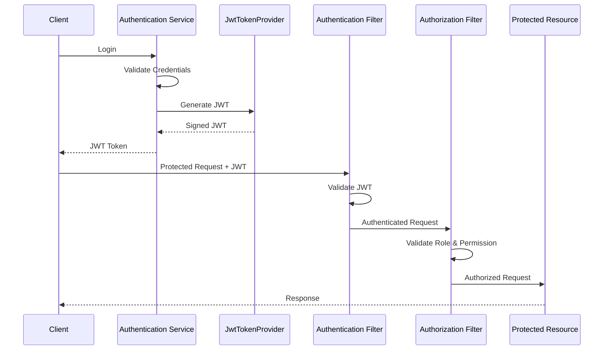

JWT functionality is provided through:

```text
security
└── crypto
    └── JwtTokenProvider
```

---

# 🔐 Two-Factor Authentication

AMS implements **TOTP-based Two-Factor Authentication**.

Compatible authenticator applications include:

* Google Authenticator
* Authy
* Other TOTP-compatible applications

## 2FA Endpoints

| Method | Endpoint                  | Purpose                          |
| ------ | ------------------------- | -------------------------------- |
| POST   | `/api/v1/auth/2fa/setup`  | Generate TOTP secret and QR code |
| POST   | `/api/v1/auth/2fa/enable` | Verify OTP and enable 2FA        |
| POST   | `/api/v1/auth/2fa/verify` | Verify OTP during authentication |

## 2FA Components

```text
security
└── twofactor
    ├── BackupCodeManager
    ├── TOTPProvider
    ├── TwoFactorAuthService
    └── TwoFactorResponse
```

The `USERS` table supports 2FA through:

```text
IS_2FA_ENABLED
TWO_FACTOR_SECRET
```

---

# 🔒 Cryptography & Data Integrity

AMS includes cryptographic utilities for authentication, integrity, and secure token operations.

| Mechanism   | Purpose                                |
| ----------- | -------------------------------------- |
| BCrypt      | Password hashing                       |
| SHA-256     | Cryptographic hashing / fingerprinting |
| HMAC-SHA256 | Integrity and authenticity protection  |
| JWT signing | Token authentication                   |

---

# 🛡️ Security Filters

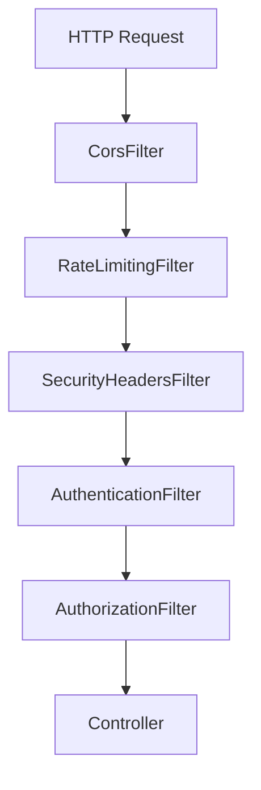

### Authentication Filter

Validates authenticated sessions or tokens before protected requests are processed.

### Authorization Filter

Validates roles and permissions before allowing access to protected resources.

### CORS Filter

Controls cross-origin HTTP requests.

### Rate Limiting Filter

Helps protect endpoints from excessive requests and abuse.

### Security Headers Filter

Adds security-related HTTP response headers.

---

# 👥 Role-Based Access Control (RBAC)

AMS follows a layered RBAC model.

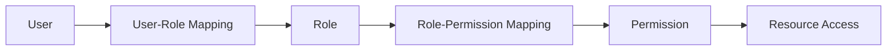

---

# 📋 Audit Management

AMS tracks security-sensitive activities for accountability.

Audited activities include:

* Login activities
* Permission changes
* Role changes
* Access requests
* Approval actions
* 2FA setup
* 2FA enablement
* 2FA verification
* Other security-related operations

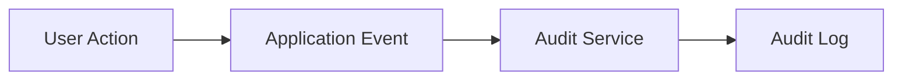

---

# 📊 Reporting System

AMS provides reporting capabilities for access and security management.

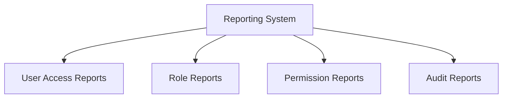

---

# 🔒 Session Management

Session management is isolated inside the security layer.

```text
security
└── session
    └── SessionManager
```

---

# 🏗️ High-Level Architecture

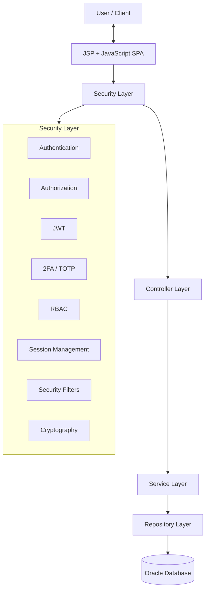

---

# 🔄 Request Processing Flow

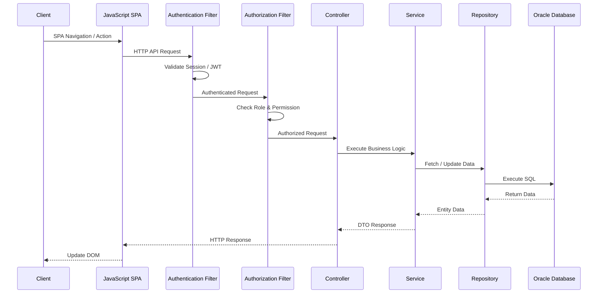

---

# 🧩 Module Architecture

AMS is organized around independent business modules.

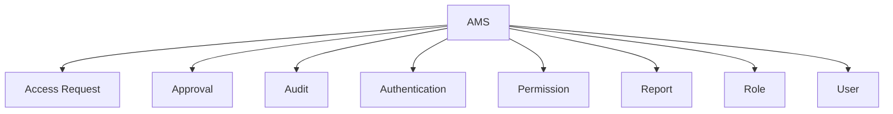

---

# 📦 Module Internal Structure

Each business module follows a consistent structure:

```text
Module
├── Controller
├── DTO
├── Entity
├── Mapper
├── Repository
├── Service
└── Validator
```

This structure supports:

* Separation of Concerns
* Maintainability
* Testability
* Module-level organization
* Code reusability

---

# 🛡️ Security Architecture

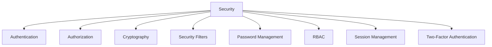

---

# 🗂️ Backend Project Structure

```text
com.ams
│
├── common
│   ├── constant
│   ├── enums
│   ├── exception
│   ├── util
│   └── validator
│       ├── CommonValidator
│       ├── EmailValidator
│       ├── PasswordValidator
│       └── PhoneValidator
│
├── config
├── migration
│
├── modules
│   ├── accessrequest
│   ├── approval
│   ├── audit
│   ├── auth
│   ├── permission
│   ├── report
│   ├── role
│   └── user
│
└── security
    ├── authentication
    ├── authorization
    ├── crypto
    │   ├── HashUtils
    │   ├── HmacUtils
    │   └── JwtTokenProvider
    ├── filter
    │   ├── AuthenticationFilter
    │   ├── AuthorizationFilter
    │   ├── CorsFilter
    │   ├── RateLimitingFilter
    │   └── SecurityHeadersFilter
    ├── password
    ├── rbac
    │   └── RBACManager
    ├── session
    │   └── SessionManager
    └── twofactor
        ├── BackupCodeManager
        ├── TOTPProvider
        ├── TwoFactorAuthService
        └── TwoFactorResponse
```

---

# 🗄️ Database Architecture

The primary database is **Oracle Database**.

## Main Tables

```text
USERS
ROLES
PERMISSIONS
USER_ROLES
ROLE_PERMISSIONS
ACCESS_REQUEST
APPROVAL
AUDIT_LOG
PASSWORD_RESET_TOKEN
```

---

# 🛠️ Technologies

## Backend

* Java
* Servlet API
* JSP
* JDBC

## Frontend

* JSP
* HTML5
* CSS3
* JavaScript ES6+
* Bootstrap 5
* Fetch API
* Client-side routing

## Database

* Oracle Database
* Oracle JDBC Driver

## Security

* BCrypt
* Session Authentication
* JWT
* RBAC
* TOTP / 2FA
* Backup Codes
* SHA-256
* HMAC-SHA256
* CORS Protection
* Rate Limiting
* Security Headers

## Tools

* Eclipse IDE
* Apache Tomcat
* Git
* Maven

---

# ⚙️ Installation & Setup

## 1. Clone Repository

```bash
git clone https://github.com/MotionPrograming/AuthorizationManagementSystem.git
cd AuthorizationManagementSystem
```

## 2. Configure Oracle Database

Install and configure an Oracle Database instance.

Create a dedicated Oracle user/schema for AMS.

Example:

```sql
CREATE USER ams_user IDENTIFIED BY password;

GRANT CONNECT, RESOURCE TO ams_user;
```

The exact privileges should be adjusted according to the Oracle environment and deployment requirements.

---

## 3. Configure Database Connection

Configure:

```text
resources/db.properties
```

Example:

```properties
db.url=jdbc:oracle:thin:@localhost:1521/XEPDB1
db.username=ams_user
db.password=password
```

---

## 4. Configure Oracle JDBC Driver

Example Maven dependency:

```xml
<dependency>
    <groupId>com.oracle.database.jdbc</groupId>
    <artifactId>ojdbc11</artifactId>
    <version>23.8.0.25.04</version>
</dependency>
```

Use the JDBC driver version compatible with the Java version and Oracle environment used by the project.

---

## 5. Run Database Migration

Execute:

```text
MigrationRunner.java
```

The versioned migration scripts will create and update the required Oracle database schema.

---

## 6. Configure Application

Verify:

* Oracle database connection
* Oracle JDBC driver
* Application configuration
* JWT configuration
* Security configuration
* Session configuration
* 2FA configuration
* Frontend/JSP configuration

---

## 7. Deploy

Deploy the application to:

```text
Apache Tomcat Server
```

Default application URL:

```text
http://localhost:8080/AuthorizationManagementSystem
```

---

# 🧠 Design Principles

The project follows:

* SOLID Principles
* Clean Code Practices
* Separation of Concerns
* Single Responsibility Principle
* Repository Pattern
* DTO Pattern
* Mapper Pattern
* Layered Architecture
* Feature-Based Architecture
* RBAC Pattern
* Modular Frontend Architecture

---

# 🚀 Frontend Development Model

The frontend is developed as a **JavaScript-enhanced JSP SPA**.

Development is organized into:

```text
1. Application Shell
        ↓
2. Global Layout
        ↓
3. Router
        ↓
4. API Client
        ↓
5. Authentication UI
        ↓
6. User Modules
        ↓
7. Admin Modules
        ↓
8. Responsive Design
        ↓
9. Validation & Error Handling
        ↓
10. UI Polish
```

The backend API contracts remain the integration boundary.

---

# 🚀 Scalability Roadmap

Future improvements include:

* REST API expansion
* OAuth 2.0 integration
* OpenID Connect (OIDC)
* Spring Boot migration
* Microservices architecture
* Redis session management
* Email notification service
* Multi-tenant SaaS architecture
* Cloud deployment
* API Gateway authorization
* Centralized Identity Provider
* Distributed audit processing
* Policy-Based Access Control (PBAC)

---

# 🔭 Future Architecture

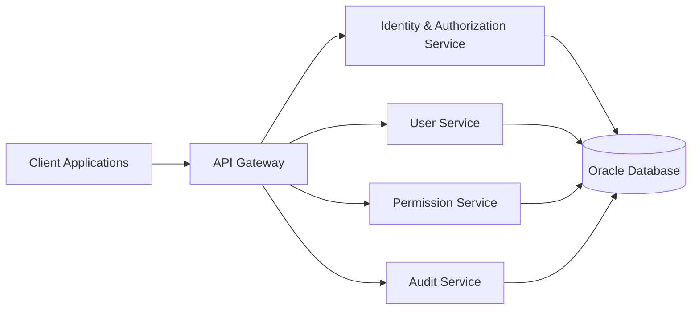

---

# 🎯 System Design Goals

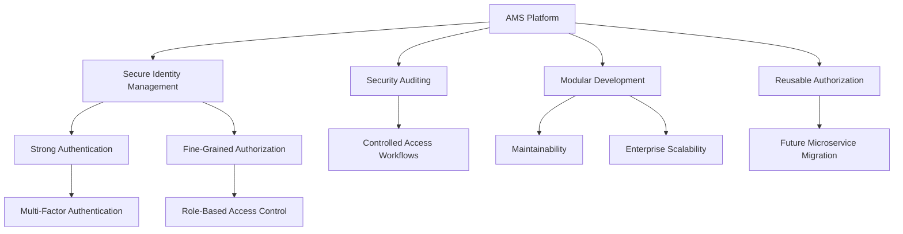

---

# 📈 Security & Authorization Flow

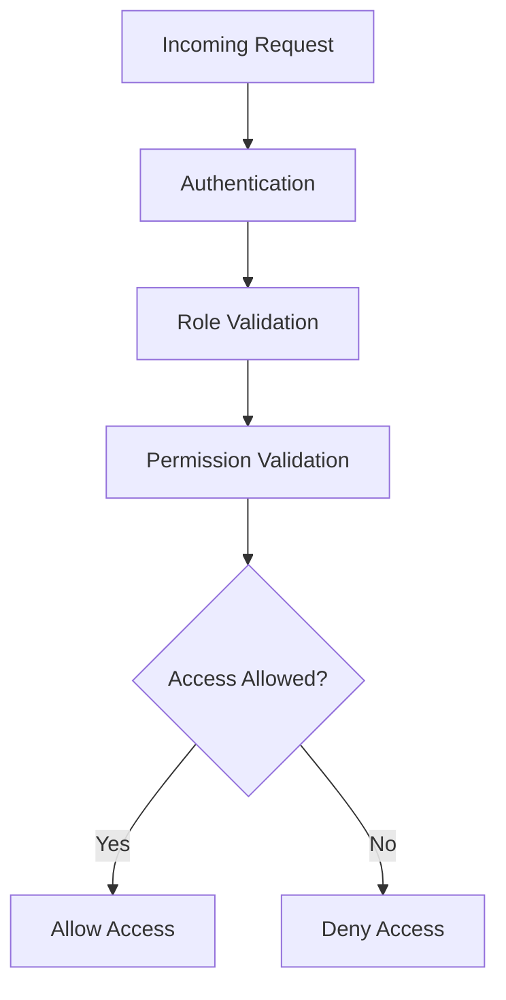

---

# 🔐 Security Responsibility Map

| Component              | Responsibility                  |
| ---------------------- | ------------------------------- |
| `AuthenticationFilter` | Authenticate protected requests |
| `AuthorizationFilter`  | Validate authorization          |
| `RBACManager`          | Manage RBAC decisions           |
| `SessionManager`       | Manage application sessions     |
| `JwtTokenProvider`     | JWT creation/validation         |
| `TOTPProvider`         | TOTP operations                 |
| `BackupCodeManager`    | Backup-code management          |
| `TwoFactorAuthService` | 2FA orchestration               |
| `HashUtils`            | Cryptographic hashing           |
| `HmacUtils`            | HMAC integrity protection       |

---

# 📌 Architecture Summary

```mermaid
flowchart TB
    CLIENT["Client"]

    SPA["JSP + JavaScript SPA"]

    AUTHENTICATION["Authentication"]
    TWOFA["2FA"]
    SESSION["Session"]
    JWT["JWT"]

    AUTHORIZATION["Authorization"]
    RBAC["RBAC"]
    PERMISSION["Permissions"]

    GOVERNANCE["Access Governance"]
    REQUEST["Access Request"]
    APPROVAL["Approval"]

    AUDITING["Auditing & Reporting"]
    AUDIT["Audit"]
    REPORT["Reports"]

    DATABASE[("Oracle Database")]

    CLIENT --> SPA

    SPA --> AUTHENTICATION

    AUTHENTICATION --> TWOFA
    AUTHENTICATION --> SESSION
    AUTHENTICATION --> JWT

    SESSION --> AUTHORIZATION
    JWT --> AUTHORIZATION

    AUTHORIZATION --> RBAC
    RBAC --> PERMISSION

    PERMISSION --> GOVERNANCE
    GOVERNANCE --> REQUEST
    REQUEST --> APPROVAL

    APPROVAL --> AUDITING
    AUDITING --> AUDIT
    AUDITING --> REPORT

    AUTHENTICATION --> DATABASE
    AUTHORIZATION --> DATABASE
    GOVERNANCE --> DATABASE
    AUDITING --> DATABASE
```

---

# 👨‍💻 Author

**Md. Abdullah**

Backend Software Engineer

### Interests

* Java
* C#
* ASP.NET Core
* Microservices
* Software Architecture
* Database Design

### Contact

**GitHub:** [github.com/MotionPrograming](https://github.com/MotionPrograming/AuthorizationManagementSystem)

---

# 📄 License

This project is developed for **educational purposes and software engineering practice**.
