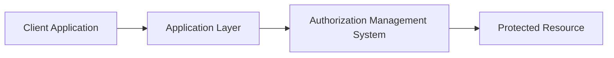
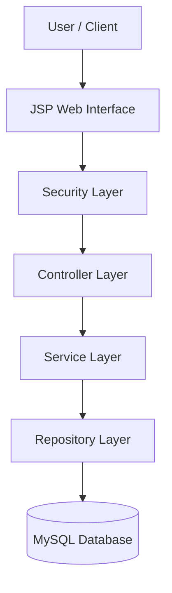
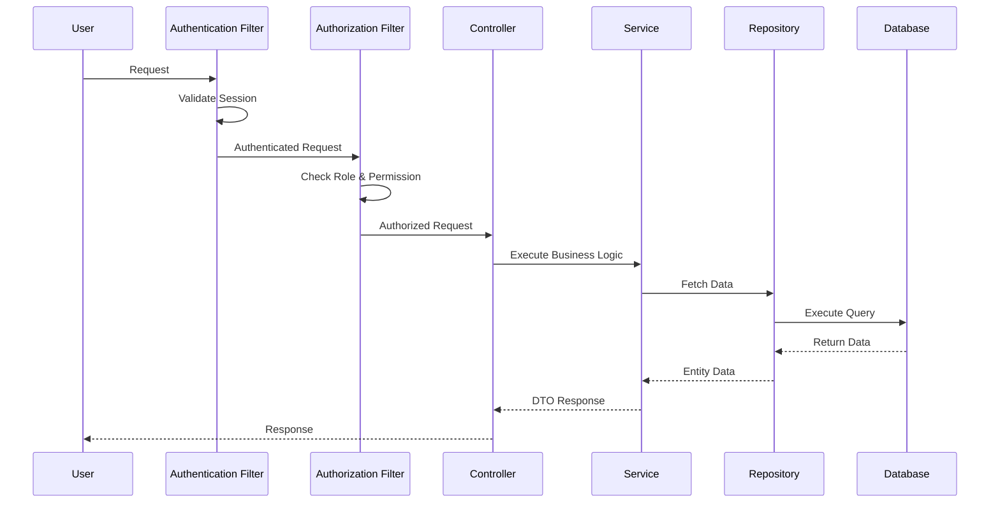
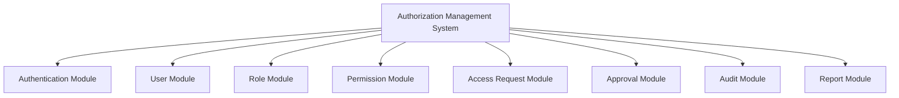
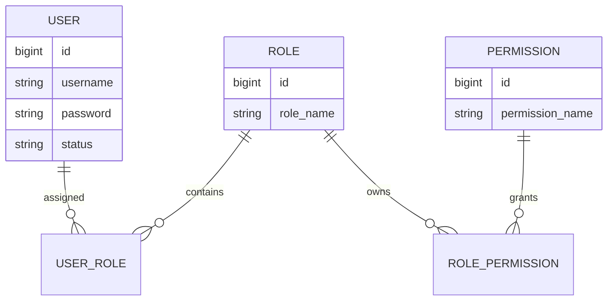
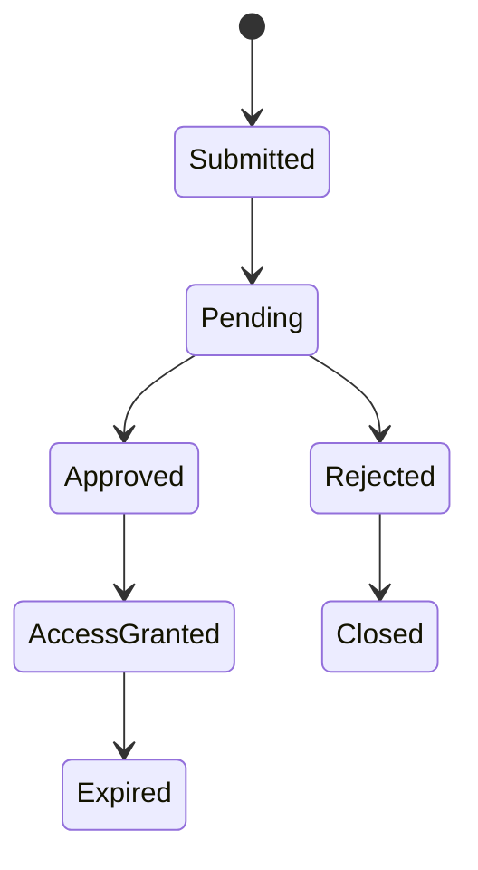
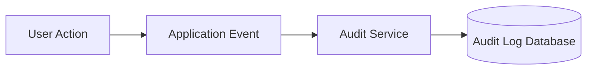
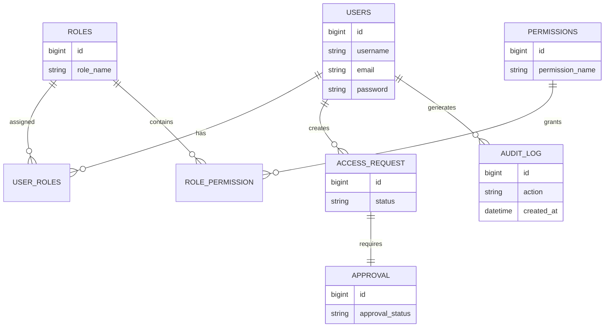
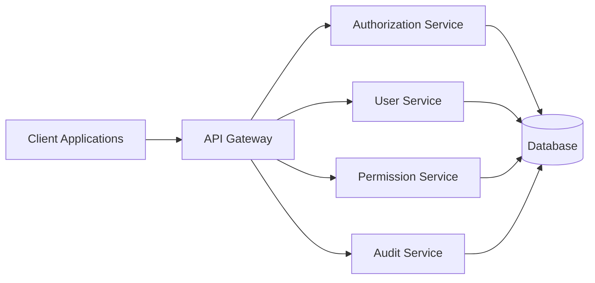

````markdown
# 🔐 Authorization Management System (AMS)

A professional **Identity and Access Management (IAM) platform** built with **Java Servlet, JSP, JDBC, and MySQL**.

Authorization Management System provides secure authentication, role-based access control (RBAC), permission management, access request workflow, approval process, and audit tracking for enterprise-level applications.

The system is designed as a reusable authorization platform that can be integrated with:

- Healthcare Systems
- ERP Applications
- SaaS Platforms
- Enterprise Applications
- Internal Management Systems

---

# 🚀 Project Vision

The goal of AMS is to build a centralized authorization platform where organizations can securely manage:

- Users
- Roles
- Permissions
- Application Access
- Approval Workflow
- Security Auditing

AMS works as an **Identity and Access Management (IAM) solution**.

---

# ✨ Core Features

## 🔑 Authentication & Security

- Secure user authentication
- BCrypt password encryption
- Session-based authentication
- Authentication Filter
- Authorization Filter
- Password management
- Role-Based Access Control (RBAC)

---

# 👥 User Management

Features:

- Create users
- Update users
- Delete users
- Activate / deactivate users
- Assign roles
- Manage user access

---

# 🛡️ Role Management

Features:

- Create roles
- Update roles
- Delete roles
- Assign permissions to roles
- Manage role-based access


Example:

```text
Admin

 |
 ├── Manage Users
 ├── Manage Roles
 └── Manage Permissions


Manager

 |
 ├── Approve Requests
 └── View Reports


Employee

 |
 └── Assigned Resource Access
````

---

# 🔐 Permission Management

Provides fine-grained authorization.

Features:

* Create permissions
* Update permissions
* Delete permissions
* Assign permissions to roles
* Permission validation

Example:

```text
Role

 |

Permission

 |

Resource Access
```

---

# 📩 Access Request Management

Provides controlled access workflow.

Features:

* Submit access requests
* Track request status
* Request additional permissions
* Temporary access management

Workflow:

```text
Employee

    |
    |
Access Request

    |
    |
Manager Review

    |
    |
Admin Approval

    |
    |
Access Granted
```

---

# ✅ Approval Workflow

Supports approval-based access management.

Features:

* Approve requests
* Reject requests
* Approval history
* Multi-level approval support

---

# 📋 Audit Management

Tracks important security activities.

Tracks:

* Login activities
* Permission changes
* Role changes
* Access requests
* Approval actions

Example:

```text
User:
John Smith

Action:
Permission Updated

Time:
2026-08-05

Status:
Successful
```

---

# 📊 Reporting System

Provides:

* User access reports
* Role reports
* Permission reports
* Audit reports

---

# 🌍 Real-World Applications

## 🏥 Healthcare Authorization System

Example:

```text
Hospital System


Doctor

 |
 ├── View Patient Records
 └── Update Prescription


Nurse

 |
 └── View Patient Information


Receptionist

 |
 └── Manage Appointment


Admin

 |
 └── Manage System Access
```

---

## 🏢 Enterprise Employee Access Management

Organizations can manage:

* Employee accounts
* Department access
* Internal applications
* Security policies

---

## 💻 Application Authorization Service

AMS can work as an authorization layer for existing applications.



---

## ☁️ SaaS Authorization Platform

Future extension:

```text
AMS Platform


Company A

 |
 ├── Users
 ├── Roles
 └── Permissions


Company B

 |
 ├── Users
 ├── Roles
 └── Permissions
```

Each organization can manage its own security policies.

---

# 🏛️ System Design

Authorization Management System follows a **Feature-Based Layered Architecture** designed for secure, maintainable, and scalable enterprise applications.

The system is divided into:

* Presentation Layer
* Controller Layer
* Service Layer
* Repository Layer
* Security Layer
* Database Layer

Design principles:

* Separation of Concerns
* Single Responsibility Principle
* Repository Pattern
* DTO Pattern
* Mapper Pattern
* RBAC Pattern

---

# 🏗️ High-Level System Architecture



---

# 🔄 Request Processing Flow



---

# 🧩 Module Architecture



---

# 📦 Module Internal Structure

Each module follows:

```text
Module

├── Controller
├── DTO
├── Entity
├── Mapper
├── Repository
├── Service
└── Validator
```

````markdown id="7m0v3h"
---

# 🔐 Security Design

AMS implements a secure authentication and authorization mechanism.

Security components:

- Authentication Service
- Authorization Service
- Authentication Filter
- Authorization Filter
- Password Encoder
- RBAC Manager
- Session Manager

---

# 🔑 Authentication Flow

Authentication verifies user identity before accessing the system.

```mermaid
flowchart LR

User[User]

Login[Login Request]

AuthService[Authentication Service]

PasswordEncoder[BCrypt Password Encoder]

UserRepository[User Repository]

Session[Session Manager]


User --> Login

Login --> AuthService

AuthService --> UserRepository

AuthService --> PasswordEncoder

AuthService --> Session

Session --> User
````

---

# 🛡️ Authorization Flow

After authentication, every protected request is validated.

```mermaid
flowchart LR

Request[User Request]

Auth[Authentication Check]

Role[Role Validation]

Permission[Permission Validation]

Decision[Access Decision]


Request --> Auth

Auth --> Role

Role --> Permission

Permission --> Decision


Decision --> Allow[Allow Access]

Decision --> Deny[Deny Access]
```

---

# 👥 RBAC Design

AMS follows Role-Based Access Control.

Relationship:



---

# 📩 Access Request Workflow

The system provides controlled access approval.



---

# 📋 Audit Logging Architecture

Every important security activity can be tracked.



---

# 🗄️ Database Design

Main database modules:

```text
users

roles

permissions

user_roles

role_permissions

access_request

approval

audit_log

password_reset_token
```

---

# 🗃️ Database Relationship Overview



---

# 📂 Project Structure

```text
com.ams


├── common
│   ├── constant
│   ├── enums
│   ├── exception
│   ├── util
│   └── validator
│

├── config
│

├── migration
│

├── modules
│   ├── auth
│   ├── user
│   ├── role
│   ├── permission
│   ├── accessrequest
│   ├── approval
│   ├── audit
│   └── report
│

└── security
    ├── authentication
    ├── authorization
    ├── filter
    ├── password
    ├── rbac
    └── session
```

---

# 🛠️ Technologies Used

## Backend

* Java
* Servlet API
* JSP
* JDBC

## Database

* MySQL

## Frontend

* HTML
* CSS
* JavaScript
* Bootstrap

## Security

* BCrypt Password Hashing
* Session Authentication
* RBAC Authorization

## Tools

* Eclipse IDE
* Apache Tomcat
* Git
* Maven

---

# ⚙️ Installation & Setup

## 1. Clone Repository

```bash
git clone https://github.com/your-username/AuthorizationManagementSystem.git
```

---

## 2. Database Setup

Create database:

```sql
CREATE DATABASE authorization_management;
```

Configure:

```text
resources/db.properties
```

Example:

```properties
db.url=jdbc:mysql://localhost:3306/authorization_management

db.username=root

db.password=password
```

---

## 3. Run Migration

Execute:

```text
MigrationRunner.java
```

Database tables will be created automatically.

---

## 4. Deploy Application

Use:

```text
Apache Tomcat Server
```

Run:

```text
http://localhost:8080/AuthorizationManagementSystem
```

---

# 📌 Design Principles

This project follows:

* SOLID Principles
* Clean Code Practices
* Separation of Concerns
* Repository Pattern
* DTO Pattern
* Mapper Pattern
* Layered Architecture
* RBAC Pattern

---

# 🚀 Future Scalability Roadmap

AMS is designed to evolve into a complete enterprise IAM platform.

Future improvements:

* REST API Support
* JWT Authentication
* OAuth2 Integration
* Spring Boot Migration
* Microservices Architecture
* Redis Session Management
* Email Notification Service
* Multi-Tenant SaaS Architecture
* Cloud Deployment
* API Gateway Authorization

Future Architecture:



---

# 🎯 System Design Goals

The architecture focuses on:

* Secure identity management
* Fine-grained authorization
* Modular development
* Easy maintenance
* Enterprise scalability
* Reusable IAM solution
* Future microservice migration

---

# 👨‍💻 Author

**MD Abdullah Rajeb**

Backend Software Engineer

Interested in:

* Java
* C#
* ASP.NET Core
* Microservices
* Software Architecture
* Database Design

---

# 📄 License

This project is developed for educational purposes and software engineering practice.

```

